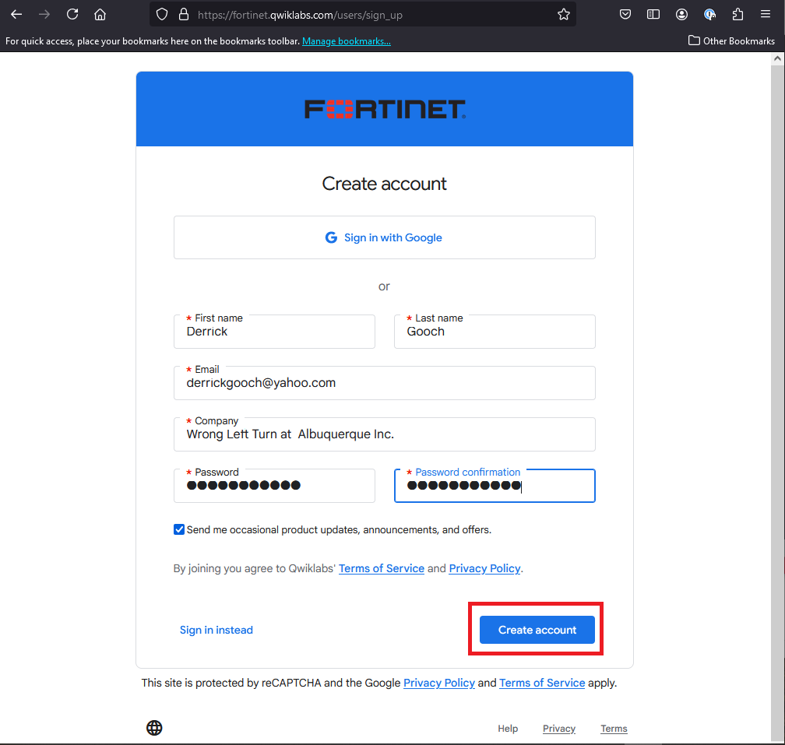
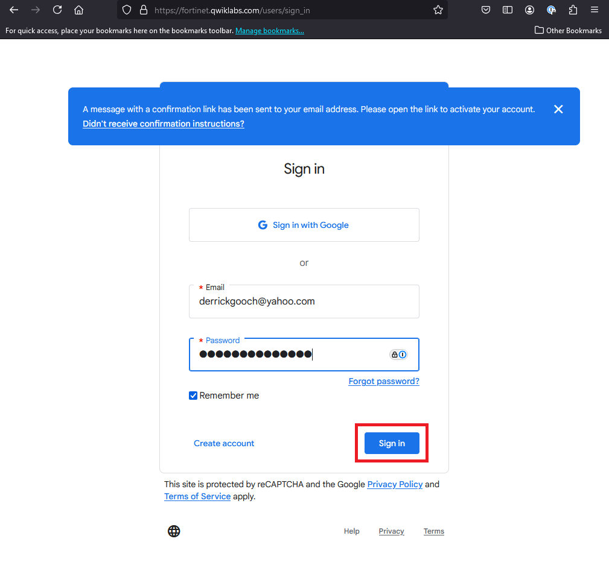
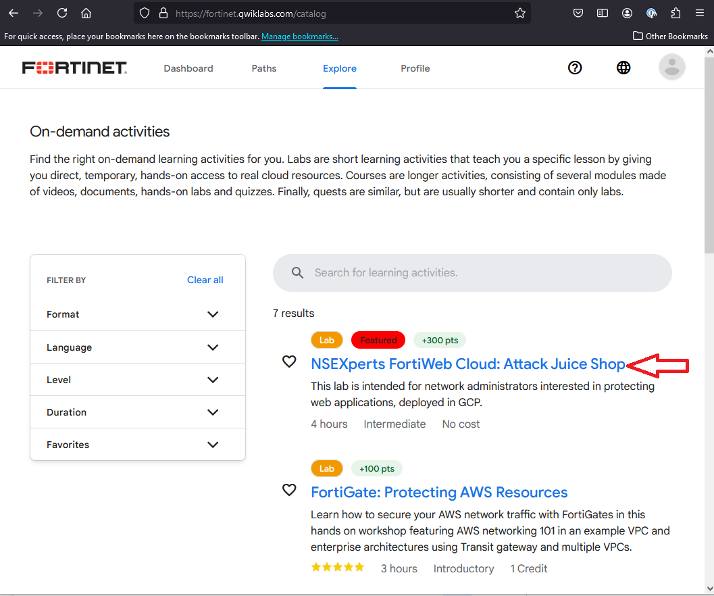

|                            |    |  
|----------------------------| ----
| **Goal**                   | Login to Qwiklabs
| **Task**                   | Create a Qwiklabs account and login.
| **Verify task completion** | You should see the NSEXperts Class in the catalog

1.  Go to **https://fortinet.qwiklabs.com** 
    - Click on the **Join** button at the top right of the screen

{}When you create an account, please use the same email address that you used when signing up for this class.{}

2.  Fill out the Create account form and click **Create account**

3.  You will be required to verify your email address in order to proceed.  Once that is complete, sign in

4.  Once you are successfully logged in, you can click on the Explore Tab at the top of the screen.  This will take you to the On-demand activities screen.  The Lab we are using today is titled **NSEXperts FortiWeb Cloud: Attack Juice Shop**.  Click on that to proceed.

{} 
Don't start the lab yet!  Prerequisites are discussed in the next Task.
{}

