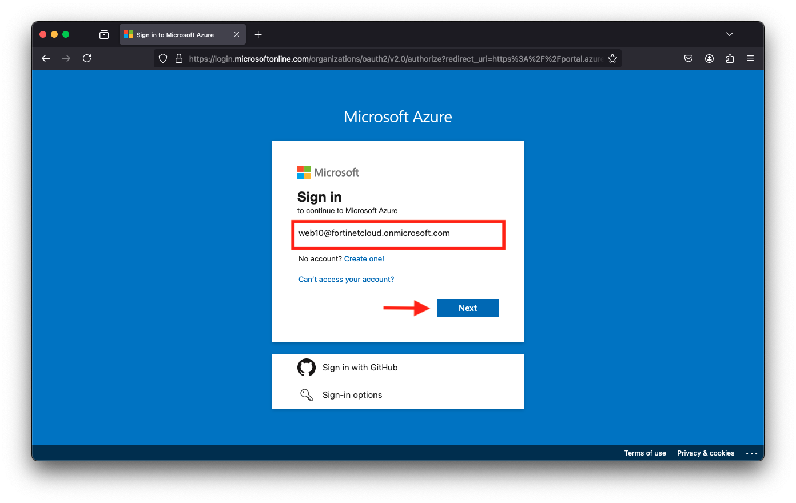
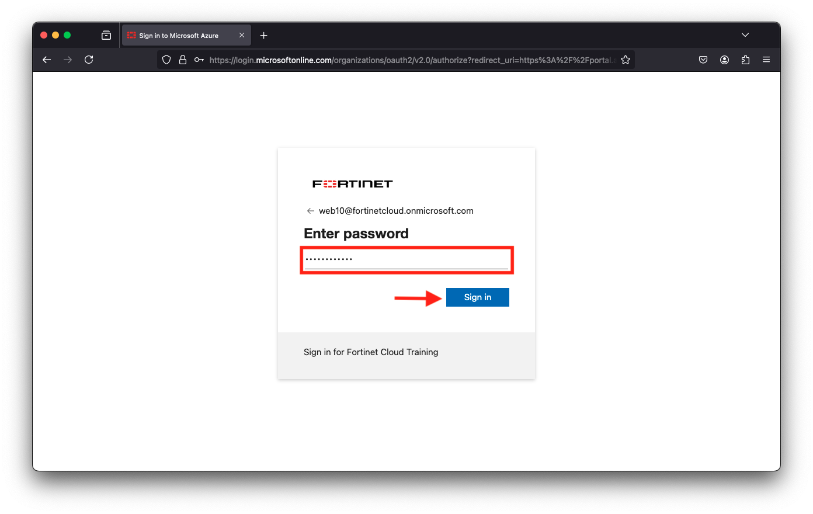
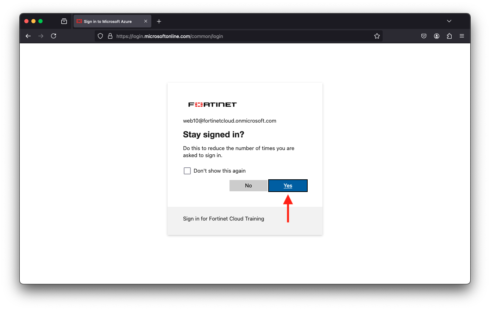
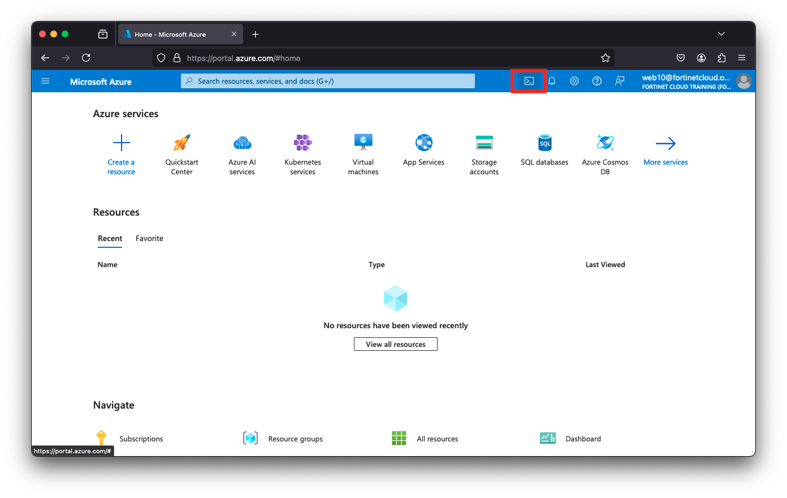
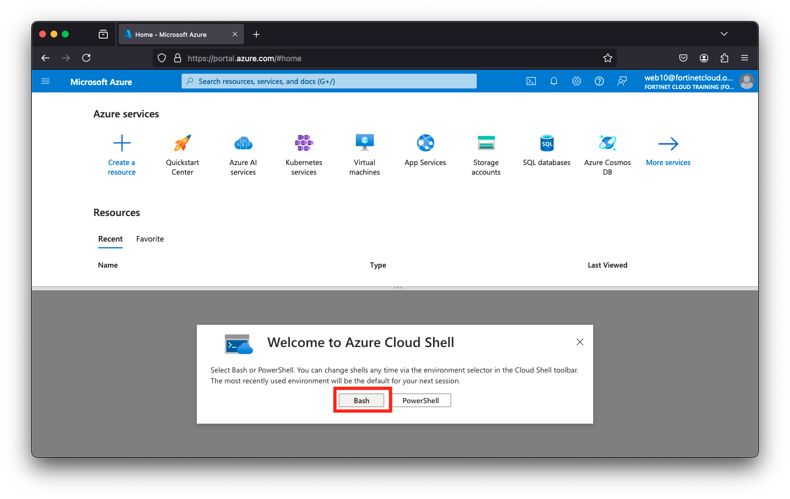
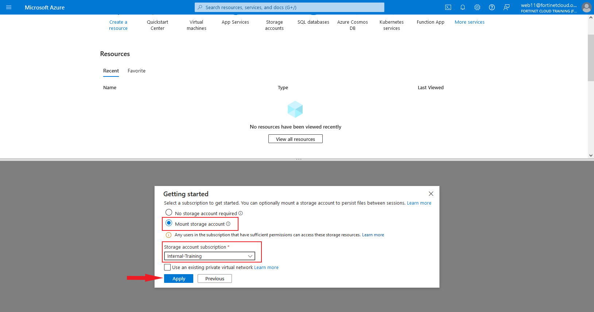
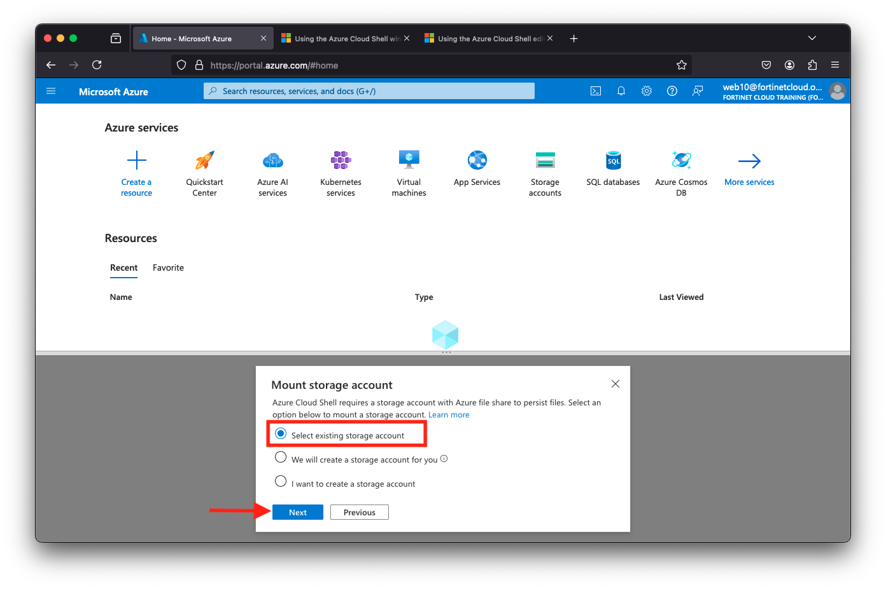
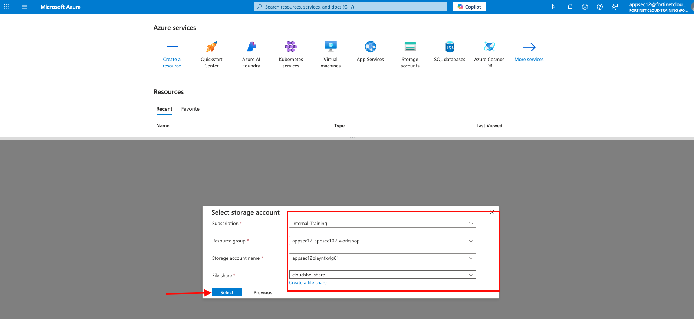

|                            |    |  
|----------------------------| ----
| **Goal**                   | Login to Azure
| **Task**                   | Create an Azure account and login.
| **Verify task completion** | You will receive an email

{} The below document references "student number" for a couple of the steps.  This is the first portion of the Username you received in the initial email with your Azure credentials.  For example if your username is **web10@fortinetcloud.onmicrosoft.com** then your student number would be **web10**  {}

#### **Setup your AzureCloud Shell**

* Login to Azure Cloud Portal [https://portal.azure.com/](https://portal.azure.com/) with the provided login/password

    
    

* Select **Yes** when asked if you would like to stay signed in

    

* If you are presented with a "Welcome to Microsoft Azure" screen, click **Cancel**
    
    

* Click on Cloud Shell icon on the Top Right side of the portal

    

* Select **Bash**

    

* Next, you will see a "Getting started" page.
    * Select **Mount Storage Account**
    * Choose **Internal-Training** as the Storage account subscription
    * Click Apply

    

* On the Mount storage account  screen 
  * click **Select existing storage account**
  * click **Next**

    

* On the Select storage account screen (values in drop down)
  * choose **Internal-Training** as description
  * resource group will be **"student number"-appsec-102-workshop** 
  * storage account name will be "student number" followed by some random numbers and letters
  * File share will be **cloudshellshare**
  * Click **Select**

    

* Your Cloud shell is now configured.