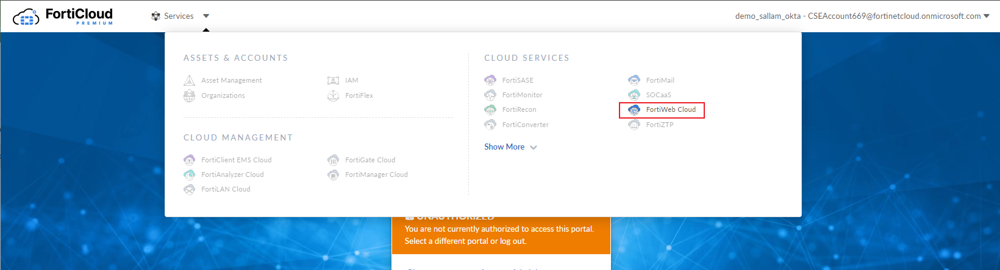

# FortiWeb
FortiWeb is Fortinet's Web Application and API security platform, enabling enterprise customers to protect web applications no matter where they are deployed.  FortiWeb defends web applications and APIs against OWASP Top-10 threats, DDOS attacks, and malicious bot attacks. Advanced ML-powered features improve security and reduce administrative overhead. Capabilities include anomaly detection, API discovery/protection, bot mitigation and advanced threat analytics to identify the most critical threats across all protected applications.

FortiWeb Cloud WAF as a Service (WAFaaS) reduces administrative overhead by offering the full suite of FortiWeb security features without the need to manage VMs and networking.  Customers simply change their DNS records so that all appication traffic is proxied through FortiWeb Cloud.

## Overview
In this lab, you will have an opportunity to configure FortiWeb Cloud to protect a Juice Shop server, emulating a very vulnerable e-commerce website.  Students will onboard their application and then run a simple SQL injection attack and an SQL map attempt.  As the format for these training session are purposefully short, in order to maintain student interest and fit into the work day.  The attacks used here are very high level. We will not be covering the ML feature set in this lab, as the training period requirements would be time prohibitive.


### Objectives
In this lab:

- When you start this lab, two VMs will be created in two different GCP projects.  One of these is Kali Linux, which will be used to attack the other, which is Juice Shop.  

## Setup and requirements
### Before you click the Start Lab button

<ql-warningbox>
Read these instructions.
</ql-warningbox>

Labs are timed and you cannot pause them. The timer, which starts when you click **Start Lab**, shows how long Google Cloud resources will be made available to you.

You should have recieved an email from **fortinetsecdevops@gmail.com** with a subject of **ForiWeb_Cloud_Training**.  This email has the proper credentials required to log into FortiWeb Cloud.  Links to the appropriate login and logout pages will be provided below.

This hands-on lab lets you do the lab activities yourself in a real cloud environment, not in a simulation or demo environment. It does so by giving you new, temporary credentials that you use to sign in and access Google Cloud for the duration of the lab.

To complete this lab, you need:

* Access to a standard internet browser (Chrome browser recommended).  
    >*Note: Use an Incognito or private browser window to run this lab. This prevents any conflicts between your personal account and the Student account, which may cause extra charges incurred to your personal account.*

* Time to complete the lab---remember, once you start, you cannot pause a lab.  
> *Note: If you already have your own personal Google Cloud account or project, do not use it for this lab to avoid extra charges to your account.*

### How to start your lab and sign in to the Google Cloud Console

1. Click the **Start Lab** button. If you need to pay for the lab, a pop-up opens for you to select your payment method. On the left is the **Lab Details** panel with the following:
    * Time remaining
    * Your temporary credentials that you must use for this lab
    * Your temporary project ID
    * Links to additional student resources

2. Open Google Cloud console in new **incognito** browser window by right clicking the **Google Cloud Console** link in **Student Resources**.
    ***Tip:*** Arrange the tabs in separate windows, side-by-side.
    >*Note: If you see the Choose an account dialog, click Use Another Account.*

3. Copy the **GCP Username** and **Password** from the **Lab Details** panel and paste it into the Sign in dialog. Click **Next**.
    > Important: You must use the credentials from the left panel. Do not use your Google Cloud Skills Boost credentials.

    >*Note: Using your own Google Cloud account for this lab may incur extra charges.*

4. Click through the subsequent pages:
    * Accept the terms and conditions.
    * Do not add recovery options or two-factor authentication (because this is a temporary account).
    * Do not sign up for free trials.

## Lab Environment

Below is a diagram of the Lab environment.


### Task 1: Check Availability of Juice Shop

Use the public IP of Juice Shop to log in: http://{{{protected_project.startup_script.Juice-Shop-IP | Juice Shop IP}}}:3000


### Task 2: Check Connectivity to Kali

Use the Kali public IP to log in: https://{{{kali_project.startup_script.Kali-IP | Kali IP}}}/vnc.html

Accept certificate errors and proceed.  When prompted, click **Connect**.  This will take you to the home screen of Kali


### Task 3: Log Into FortiWeb Cloud

1.  Using an **Incognito** browser, navigate to the below URL:

```sh

https://customersso1.fortinet.com/saml-idp/proxy/demo_sallam_okta/login 

```

2.  Input the username from the email you recieved from **fortinetsecdevops@gmail.com** and click **Next**


3.  Input the password from the email you recieved from **fortinetsecdevops@gmail.com** and click **Sign in**


For the next step, choose **Yes**.  You do want to stay logged in.

<ql-infobox> Sometimes if you wait too long to input your password, you will get SAML login portal error "Error: SAML response with InResponseTo is too late for previous request"  If this happens just click the small blue "Login" link. </ql-infobox>

4. This will take you to the FortiCloud Premium Dashboard. At the top of the screen select **Services** > **FortiWeb Cloud**

<ql-infobox>When you log in, you will see that you are unauthorized to view the FortiCloud Premium Dashboard.  This is expected, as this user has not been given this permission.</ql-infobox>




