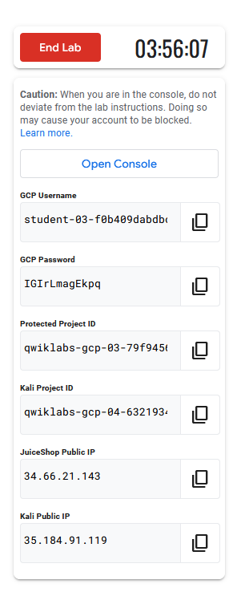

### Before you click the Start Lab button

{} 
Read these instructions.
{}

Labs are timed and you cannot pause them. The timer, which starts when you click **Start Lab**, shows how long Google Cloud resources will be made available to you.

You should have recieved an email from **fortinetsecdevops@gmail.com** with a subject of **ForiWeb_Cloud_Training**.  This email has the proper credentials required to log into FortiWeb Cloud.  Links to the appropriate login and logout pages will be provided below.

This hands-on lab lets you do the lab activities yourself in a real cloud environment, not in a simulation or demo environment. It does so by giving you new, temporary credentials that you use to sign in and access Google Cloud for the duration of the lab.

To complete this lab, you need:

* Access to a standard internet browser (Chrome browser recommended).  
    >*Note: Use an Incognito or private browser window to run this lab. This prevents any conflicts between your personal account and the Student account, which may cause extra charges incurred to your personal account.*

* Time to complete the lab---remember, once you start, you cannot pause a lab.  
> *Note: If you already have your own personal Google Cloud account or project, do not use it for this lab to avoid extra charges to your account.*

### How to start your lab and sign in to the Google Cloud Console

1. Click the **Start Lab** button. If you need to pay for the lab, a pop-up opens for you to select your payment method. On the left is the **Lab Details** panel with the following:
    * Time remaining
    * Your temporary credentials that you must use for this lab
    * Your temporary project ID
    * Links to additional student resources  

Leave this browser up, so you can copy/paste these resources as needed.  It is also, not a bad idea to create a text file with the values presented.

2. Open Google Cloud console in new **incognito** browser window by right clicking the **Google Cloud Console** link in **Student Resources**.
    ***Tip:*** Arrange the tabs in separate windows, side-by-side.
    >*Note: If you see the Choose an account dialog, click Use Another Account.*

3. Copy the **GCP Username** and **Password** from the **Lab Details** panel and paste it into the Sign in dialog. Click **Next**.
    > Important: You must use the credentials from the left panel. Do not use your Google Cloud Skills Boost credentials.

    >*Note: Using your own Google Cloud account for this lab may incur extra charges.*

4. Click through the subsequent pages:
    * Accept the terms and conditions.
    * Do not add recovery options or two-factor authentication (because this is a temporary account).
    * Do not sign up for free trials.
