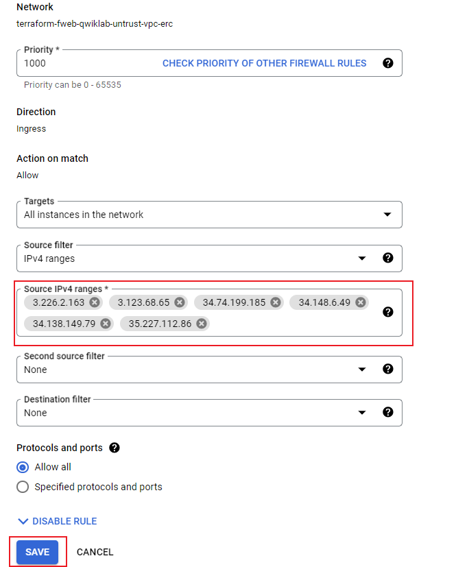
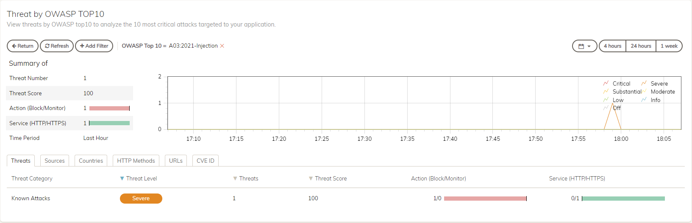

## Onboard Juice Shop Application

### Task 1: Add Application

1. At the top of the screen, clci, on **+ ADD APPLICATION** 


2. For Step 1 "WEBSITE" 

- for **Web Application Name** enter the number of the username found in the email you recieved from **fortinetsecdevops@gmail.com**.   

<ql-infobox>For example, if the Username is CSEAccount669@fortinetcloud.onmicrosoft.com the number would be 669</ql-infobox>

- For **Domain Name** use number.fwebtraincse.com and then select next


2. For Step 2,

- **unselect "HTTP"** as we want to force users to interact with FortiWeb using only HTTPS.
- For **IP Address or FQDN** enter the JuiceShop Public IP {{{protected_project.startup_script.Juice-Shop-IP | Juice Shop IP}}}
- For **Port** enter "3000"
- Select HTTP for Server Protocol.  This is Juice Shop and it is NOT secure
- Click on **Test Origin Server**  You should see a green box pop up that says "Test successfully"
- Choose **Next**


3. For Step 3 "CDN" we will not change anything.  You will notice the Selected WAF Region shows the Platform "Google Cloud Platform" and the Region.  

<ql-infobox>FortiWeb Cloud automatically chooses the platform and region based on the IP Address of the application.  There is no user intervention required.</ql-infobox>

- Select **Next**


4. In Step 4 "SETTING" we will **NOT** enable Block Mode

- Select **Save**


5. In Step 5 "CHANGE DNS" We are presented with very important information regarding DNS settings which need to be changed in order to direct traffic to FortiWeb Cloud.  In this lab, we will not be doing this, as sometimes it can take a while for the DNS settings to propagate.  

<ql-warningbox> 
Take Note of the IPv4 addresses and CNAME for use in a later step.  **Before you close!**
</ql-warningbox>

- Select **Close**


6. You should now see your Application listed in FortiWeb Cloud.  Note that the DNS Status is set to **Update Pending** This is expected and we will ignore it.


<ql-warningbox>This is a **Shared Environment** !!!  Please ensure that you are only making changes to **Your Application**.  After Applications are onbaorded into FortiWeb Cloud, Administrators have full RBAC capabilities, but we will not be activating that during this 90 minute lab.</ql-warningbox>

## Secure Google Infrastructure

This lab was originally bootstrapped with and ingress firewall rule which allows all ports and protocols from all sources (0.0.0.0/0).  This is not a best practice.  It is recommended, to only allow necessary ports and/or sources.  Now that we have onboarded our application, we want to ensure that the only device that can communicate with our application is FortiWeb Cloud.

<ql-infobox>
For the below steps, ensure that you are in the Protected Project in the GCP Console.  When you log into the console for the first time, you are directed to the Protected Project by default.  This can be changed by clicking on the drop down at the top left of the console screen, between the Google Logo and the Search bar.
</ql-infobox>

Protected Project ID = {{{protected_project.project_id | Protected Project}}}

### Task 1: Modify GCP Network Firewall Rules

1. First, let's grab the IPs which FortiWeb Cloud will use to communicate with your application. From the FortiWeb Cloud Applications page, select **Allow IP List** from the top of the page.  This will open a dialog showing Management and Scrubbing Center Addresses.  Clcik on **Copy to Clipboard**.  Paste these IPs into a text document and then click **Return**


2. In the Google Console, select the "Hamburger" menu at the top left of the screen and navigate to **VPC network > Firewall**


3. Click on the Ingress rule named **terraform-fweb-qwiklab-untrust-vpc-(random)-ingress**


4. Click **EDIT** at the top of the page.

5. Scroll down to **Source IPv4 ranges**.  Delete **0.0.0.0/0** and enter the IP's copied from FortiWeb Cloud in step 1.  Then Click Save



6. To ensure that it worked, use your browser to try and navigate to Juice Shop: http://{{{protected_project.startup_script.Juice-Shop-IP | Juice Shop IP}}}:3000

You should **NOT** be able to access Juice Shop Directly.

## Simple SQL Injection

### Task 1: Perform a simple SQL injection attack

According to the Open Worldwide Application Security Project (OWASP):

<ql-infobox>
A SQL injection attack consists of insertion or “injection” of a SQL query via the input data from the client to the application. A successful SQL injection exploit can read sensitive data from the database, modify database data (Insert/Update/Delete), execute administration operations on the database (such as shutdown the DBMS), recover the content of a given file present on the DBMS file system and in some cases issue commands to the operating system. SQL injection attacks are a type of injection attack, in which SQL commands are injected into data-plane input in order to affect the execution of predefined SQL commands.
</ql-infobox>

You can find more information at "https://owasp.org/www-community/attacks/SQL_Injection"

For this task, we will just use a simple Browser.

1. Log into Kali linux: https://{{{kali_project.startup_script.Kali-IP | Kali IP}}}/vnc.html

2. Since we did not modify the DNS record we will enter a host entry on Kali.  Open the terminal emulator by clicking on the black box at the bottom of the Kali Hom screen. At the prompt, type:

```sh
bash
sudo nano /etc/hosts
```

3. When the host file opens you will need to add in the host entry in the format "ip address number.fwebtraincse.com" at the bottom of the file.  For this you can enter one or both of the IP Addresses you noted earliear during "Step 5" of the onboarding earlier.   Once this is complete, type **ctrl+o** followed by **enter** and then **ctrl+x**


4. Now let’s Navigate to the browser (located at thebottom of Kali home page) and type the URL. into the navigation bar https://number.fwebtraincse.com.  Accept warnings and proceed to the application

<ql-infobox>If we had modified the DNS record at the begining of this lab, FortiWeb would have pulled a valid SSL certificate from Let's Encrypt.</ql-infobox>


5. Let’s perform a very simple SQLi attack. To perform a SQLi attack append ?name=' OR 'x'='x to your URL.  Be sure that you use **YOUR NUMBER**.  Below is just an example.

```sh

For example: https://669.fwebtraincse.com/?name=' OR 'x'='x

```

<ql-infobox>
The attack will go through and you will see the Juice Shop Home page
</ql-infobox>

### Task 2:  Protect WebServer from Attack

1. Enable Block Mode on FortiWeb Cloud

On the Applications page enable block mode by clicking on the Block Mode button


2. Repeat the same step to perform SQLi attack in the browser.

```sh

For example: https://669.fwebtraincse.com/?name=' OR 'x'='x

```

<ql-infobox>
You will see that FortiWeb now blocks the SQLi attack.
</ql-infobox>


3. Now let's navigate to our application page in FortiWeb Cloud, by clicking on the Application Name.  This should take you to the Application **Dashboard**.  You should see a Threat listed in the **OWASP Top 10 Threats box called A03:2021-Injection.  Click on it.


4. Navigate through some of the tabs.



5. On the **Threats** tab, click on the Threat.  In this case **Known Attacks**.  This will take you to a list showing dates when this type of attack was encountered.  If you click on the Arrow next to the date, more information about that incident can be seen.  Spend some time clicking around on the Clickable links in this output.  There is a lot of information available from here, including a link to the OWASP Top 10 site describing this attack as well as HTTP header information and matched patterns.


### Task 3:  FortiWeb Cloud Options

In the previous task, we simply turned on Block Mode in FortiWeb Cloud.  This enabled the default, minimum security configuration.  Take a moment now to click through some of the menu options on the left to see what Features are enabled by default.  We will also look at how to enable new features.

1. Navigate to **Security Rules** on the left menu and click on **Known Attacks** to see what features are turned on.  The first category is Signature Based Detection.  Click the **Search Signature** button on the right and search for the injection Keyword.  


2. On the left menu, click through the available menus for **Access Rules, Bot Mitigation and DDOS Prevention**

3. **Vulnerability Scan** is an additional paid service that can be added to FortiWeb Cloud, which will scan your protected Applications for OWASP Top 10 vulnerabilities.

<ql-infobox>
More information can be found in the docs at:
https://docs.fortinet.com/document/fortiweb-cloud/23.3.0/user-guide/898181/vulnerability-scan
</ql-infobox>

4. Next Click on **+ Add Modules**.  This is where we can activate additional security featuresfeatures.  These features are all covered under the FortiWeb Cloud WAF-as-a-Service License, which is billed based on the number of websites protected and the average Mbps throughput in aggregate for all protected sites.

<ql-infobox>
FortiWeb Cloud Datasheet:
https://www.fortinet.com/content/dam/fortinet/assets/data-sheets/fortiweb-cloud.pdf
</ql-infobox>

## Dig Deeper

Now that we have done a simple SQL injection attack, let's take a deeper dive into one of the tools that an actual hacker (or Red Team) might actually use to attack an application.

### Task 1: Use Burp Suite to find a vulnerability

Burp Suite gives us a quick and easy way to query targeted sites.

1. At the bottom of the Kali home page, click on the terminal icon (black box).  Once open, input:

```sh

burpsuite

```

2. Burp Suite will pop up. Accept all of the warnings and EULAs.  Leave Temporary Project selected and click **Next**


3. Leave "Use Burp defaults" selected and click **Start Burp**.


4. Accept the warning that Burp Suite is out of date and then select settings at the top right of the screen.


5. In the settings menu, select **Burp's browser**.  Under **Browser running** check the box for "Allow Burp's browser without a sandbox"


>*Note: once the button is clicked, just close the settings menu.  There is no need to save.*

6. Click on the **Proxy** tab at the top of the Burp Suite screen.  This will bring you to the Intercept screen.  Click on **Open Browser**.  Ignore Error and proceed to next step.


7. In the browser URL bar, input https://number.fwebtraincse.com and hit enter.  This will bring you to the juice shop home page.

8. Minimize the browser and click on the **HTTP History** tab under Proxy.  Scroll down the list until you find a URL labeled **"/rest/products/search?q=**.  Select this line and right click.  Then click on **Send to Repeater**.  This will allow us to manipulate the requests in order to do a little nefarious recon.


9. At the top of Burp Suite, Click on the **Repeater** Tab.  You will see the request we just sent.  Now click on the **Send** Button.  This will populate the Response area.


10. Now we are going to modify our query a bit.  Click on the First line in the Raw request and add **'--** to our get request after.  The GET should now look like **/rest/products/search?q='--**.  Click **Send**.  We will now see an error in the Response section.  This error tells us that the database is SQLITE and uncovers a vulnerability.


<ql-infobox>It's worth mentioning that the standard signature based Web Protection Profile did not catch this attempt. If Machine Learning were enabled, this would not have gone through.  Instead it would have been identfied as an anomaly and then passed to the threat engine where it would have been identified as an SQL Injection attempt.  We are not using ML in this lab, as the number of samples required to train the Model would be time prohibitive</ql-infobox>

### Task 2: Use SQLMAP to exploit vulnerability

Now that we know what the Database type is, we can use sqlmap to see if we can get some "Juicy" information (pun intended).  You could just run SQLMAP initially to find the vulnerability, but It would take much longer without an idea of what you were looking for.

1. Open a new terminal on Kali, and take a look at the SQLmap help page.  I also think it's helpful to use bash shell here, as we will want to be able to use the up arrow in order to scroll though old commands

```sh

bash
sqlmap -h

```

2. Now we will attempt to discover what typ SQL injection vulnerabilities exist.  Since we know that the database runs on **sqlite** we can shorten the scan time by giving sqlmap that information.  Input the first line below at the terminal, substituting your URL.

```sh

sqlmap -u "https://number.fwebtraincse.com/rest/products/search?q="  --dbms=SQLite --technique=B --level 3 --batch

```

<ql-infobox>This attempt will fail, due to the default protections offered by FortiWeb.  It is still recommended to use ML in production in order to prevent reconnasiance from previous step</ql-infobox>


3. Disable Block Mode on your application in FortiWeb Cloud


4. Re-run the sqlmap attempt.  You will see that some vulnerabilities were found.


## Delete your Application

1. You are almost done!  Please take a moment to delete only **Your Application** using the trashcan Icon on the right side of the applicaion listing.


2. Please use the below link to log out of FortiCloud

```sh
https://customersso1.fortinet.com/saml-idp/proxy/demo_sallam_okta/saml 
```
Be sure to click the small blue **Logout** button at the bottom of the text.

### Congratulations

Congratulations, you have successfully completed this lab!  Your environment will automatically delete itself at the end of the alloted lab time.
