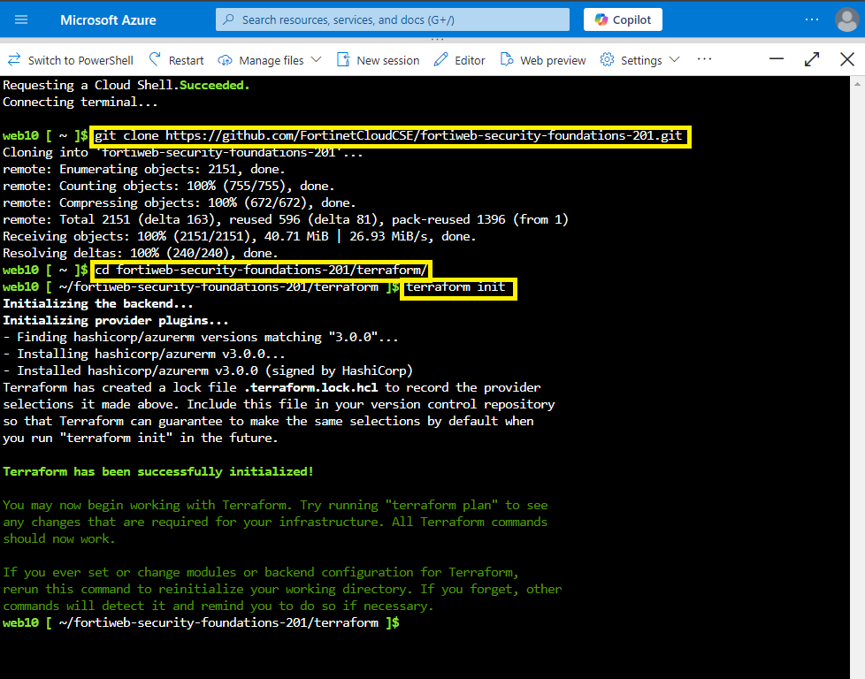
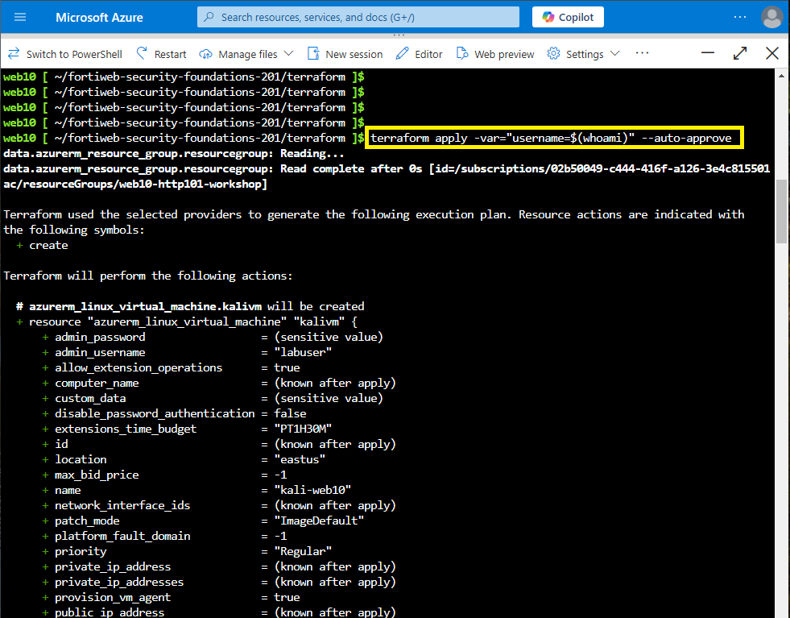
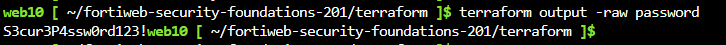

|                            |    |  
|----------------------------| ----
| **Goal**                   | Run Terraform
| **Task**                   | Clone the repo and run the terraform commands
| **Verify task completion** | You should be able to see the output of terraform


### Launch resources using Terraform

All the components required for Lab are deployed through terraform. 


Perform the following steps in your Cloudshell console to create your environment.

1. Clone the Github repo `git clone https://github.com/FortinetCloudCSE/fortiweb-security-foundations-201.git`
2. Change directory to the `cd fortiweb-security-foundations-201/terraform` folder
3. Run `terraform init`

```sh
git clone https://github.com/FortinetCloudCSE/fortiweb-security-foundations-201.git
cd fortiweb-security-foundations-201/terraform
terraform init
```



    
4. Run the following command to apply it

    ```sh
   terraform apply -var="username=$(whoami)" --auto-approve
    ```

    {} 

You can manually specify your username (found in your Azure Account email) in the command  
If your Workshop Azure account login is web31@ftntxxxxx.onmicrosoft.com, your username is **web31**, and the command to enter is:

```sh
terraform apply  -var='username=web31' --auto-approve
```
    
    {} 



    
5. Terraform deployment takes atleast 10-15 min to complete.
  * Once Terraform is complete you should see the output. Please copy the output to notepad.


7. To print the node VM's login password, you can run this command 

   ```
   terraform output -raw password
   ```

