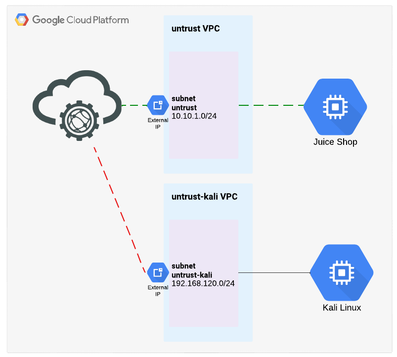
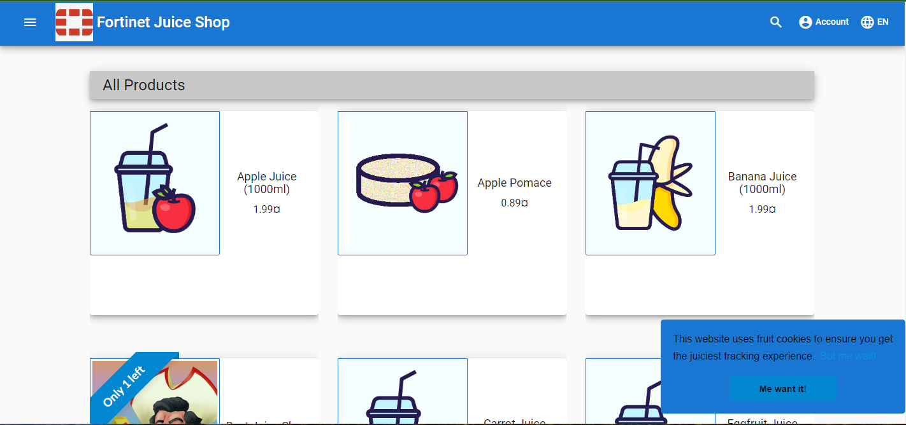
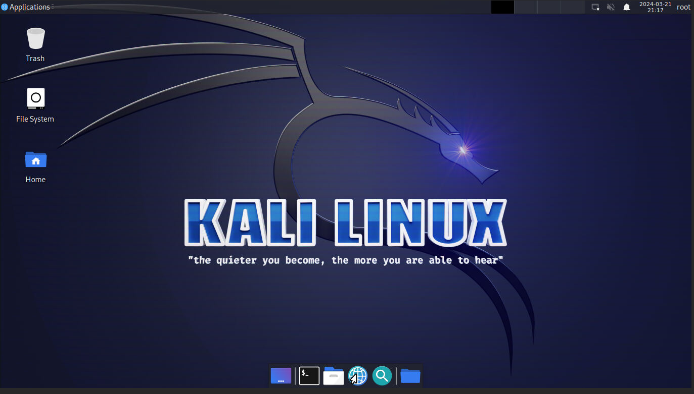
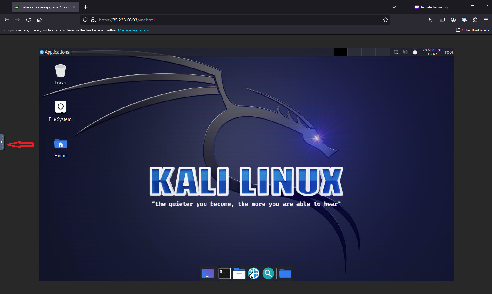
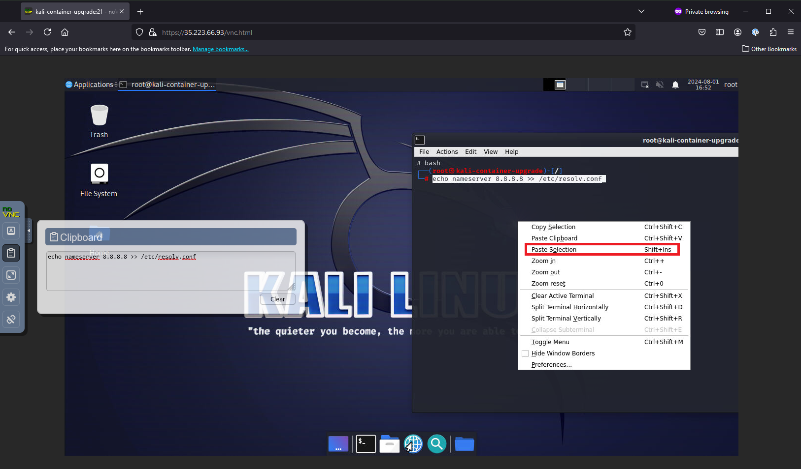

|                            |    |  
|----------------------------| ----
| **Goal**                   | Verify Lab availablity
| **Task**                   | Navigate to Kali Linux and Juice Shop servers
| **Verify task completion** | You should be able to access both Kali and Juice Shop.  All commands in step 4 should complete successfully.


Below is a diagram of the Lab environment.



### Check Availability of Juice Shop

Use the public IP of Juice Shop (provided in the QwikLabs console) to log in: ```http://{{Juice Shop IP}}:3000```



### Login to Kali

1.  Use the Kali public IP (provided in the QwikLabs console) to log in: ```https://{{Kali IP}}/vnc.html```

Accept certificate errors and proceed.  When prompted, click **Connect**.  This will take you to the home screen of Kali



2.  In order to copy/paste into Kali, we will need to click on the tab at the left hand side of the screen.



3.  This will open the tab revealing a couple of options.  Select the clipboard icon and paste your text into the box.  Once the text is in the box, you can right click on the desktop and select Paste Selection to paste in the text.  When done, you can click on the arrow to hide the clipboard.



 4.  From the Kali Linux session, open a terminal window and Enter the following:

 {} 
Do not paste these commands in all at once.  We have seen some situations, in which some of the commands fail, which causes issues later in the lab. 
{}

```sh
bash
echo nameserver 8.8.8.8 >> /etc/resolv.conf
apt-get update
apt-get install nano
wget https://dl.pstmn.io/download/latest/linux_64 -O /tmp/linux_64 && tar xvzf /tmp/linux_64 -C /tmp/ && sudo mv /tmp/Postman /opt/ && sudo ln -s /opt/Postman/app/Postman /usr/local/bin/Postman
```
