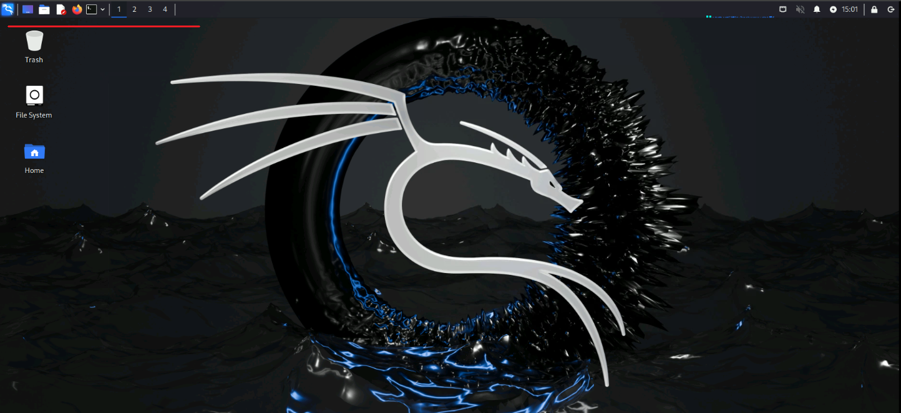

|                            |    |  
|----------------------------| ----
| **Goal**                   | Start Kali RDP
| **Task**                   | Navigate to Kali Linux and Juice Shop servers
| **Verify task completion** | You should be able to access both Kali and Juice Shop.  All commands in step 4 should complete successfully.


### ***Logging into your student environment***

## Prereqs
  - Internet Access
  - Web Browser
    - Any modern browser will work.  Some people have had issues with Safari.  If that happens, please try Firefox or Chrome.  Your student environment includes a client and server with all required software.


### Start Kali RDP

For this lab, we will only need to interact with the Kali linux device.  We will use guacamole to create an RDP session in your browser.

- In your browser window, type in the url below, substituting your Kali server IP.

  {}
  Kali Linux takes about 20 minutes to fully deploy, so you may get a connection refused error.  Please be patient and the login prompt will eventually appear.  Even after Kali is reachable via HTTPS, some of the initial packages may still be downloading.
  {}

  {} Depending on your browser, you will likely need to accept the self-signed certificate warnings.  {}
  ```
  https://<kali-IP>:8443
  ```
- Accept all warnings and proceed to the site.
- You will be prompted to login to Apache Guacamole.  
  - Enter ```guacadmin``` for Username and enter ```S3cur3P4ssw0rd123!```
  - Click **Login**


- The Guacamole home page will have a list of connections.  Click on the connection labeled **Lab Desktop**


- Note the icons at the top left of the home screen.  We will be using these during the lab.



### Paste text into Kali Desktop

There are portions of this lab that will require large amounts of text to be entered on the Kali desktop. To accomplish this:
- You will need to open (and close) the Guacamole menu by typing **ctrl+alt+shift** for Windows or **ctrl+command+shift** for MAC. 
- Paste your text into the window, and select **Text input** as the Input method.


- Right-click on the desktop where you want to past and click "paste" or "paste from clipboard" depending on which option is available.