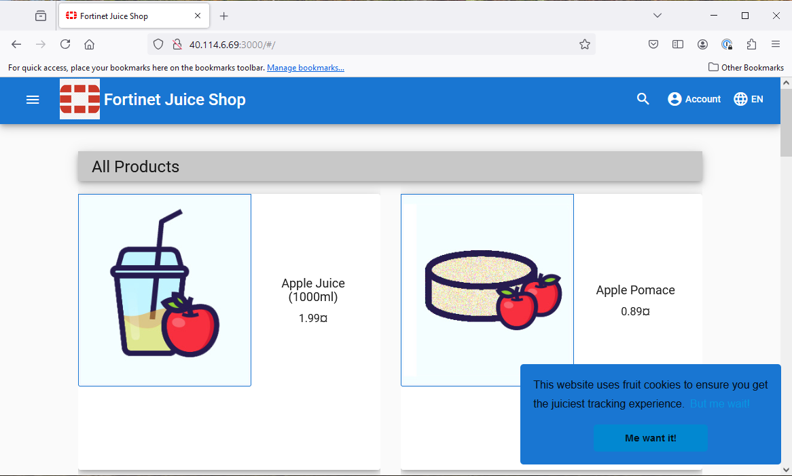

|                            |    |  
|----------------------------| ----
| **Goal**                   | Verify that Juice Shop is working
| **Task**                   | Navigate to the public IP associated with Ubuntu
| **Verify task completion** | You should see the Juice Shop Home Page


### Start Kali RDP

From your Terraform Outputs in Task 2 you should have seen gotten the Public IP address of ubnutu.  

- By default, Juice shop listents on port 3000.  In your favorite browser, type ```http://<ubuntu-ip>:3000``` 
- You should see a screen like below:



- You can now proceed to the the next module
