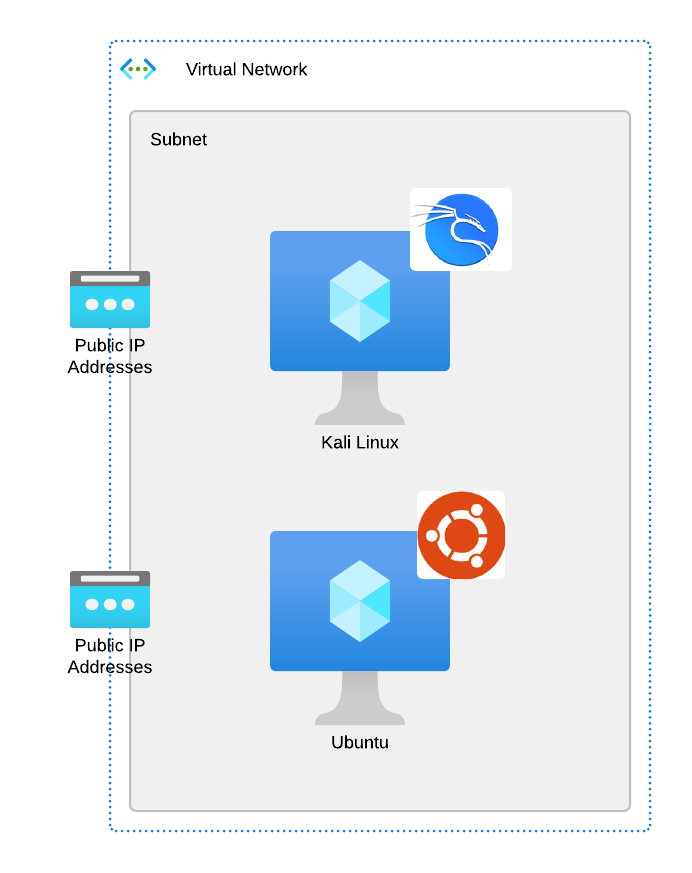

## Provisioning the Azure environment (40min)

Provision your Azure Environment, enter your Email address and click _Provision_




Provisioning can take several minutes.

\*\*\* __PLEASE DO NOT SUBMIT MULTIPLE TIMES__ \*\*\*  



When provisioning is complete, one of the following will happen.

* You will receive an email with Azure environment credentials. Use those credentials for this environment, even if you have your own.
* You will receive and email indicating that there are no environments available to utilize. In this case please try again at a later date.
* You will receive an email indicating that the supplied email address is from an unsupported domain.
* No email received due to an unexpected error. You can try again or notify the Azure CSE team.

Tasks

* Setup Azure Cloud Shell
* Run Terraform
* Verify Terraform

## Student Setup Diagram

Each Student will have their own environment for the lab. The following diagram provides an overview of the Student environment.

   