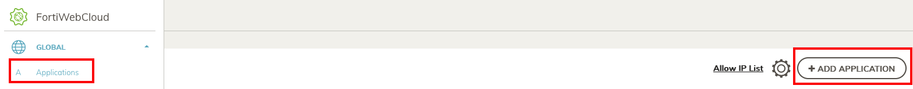
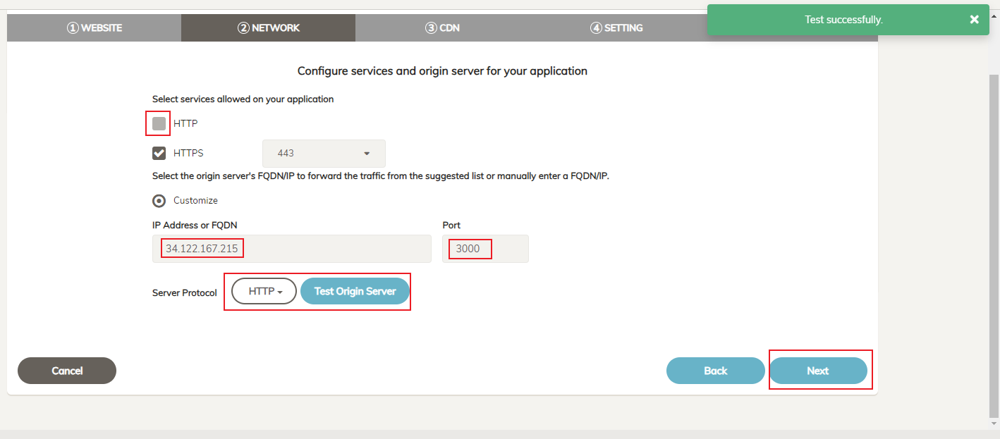
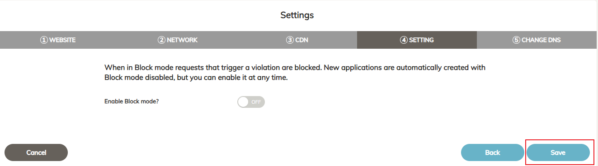
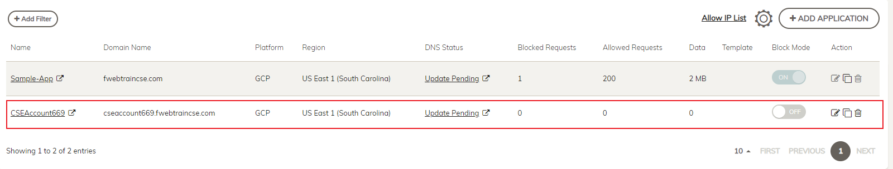
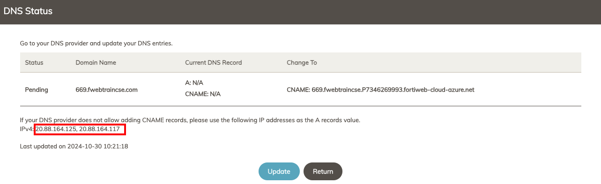

|                            |    |  
|----------------------------| ----
| **Goal**                   | Start protecting Juice Shop Application with FortiWeb Cloud
| **Task**                   | Onboard Application in FortiWeb GUI
| **Verify task completion** | Your Application will show up in the Application list.

### Add Application

1. Open the **Applications** view from top left menu bar, and then click, on **+ ADD APPLICATION** 

    

2. **_Tab 1: "WEBSITE"_** 

   - In **Web Application Name** enter your FortiWeb Cloud StudentID number which you used to login to FortiWeb Cloud (found at the top right corner of the FortiWeb Cloud Screen).   

    {}For example, if your FortiWeb Cloud User is **CSEAccount669@fortinetcloud.onmicrosoft.com**, your Student ID would be: **669**{}

   - For **Domain Name** use ```<studentId>.fwebtraincse.com``` and then select next
    

2. **Tab 2: Network**,

   - **unselect "HTTP"** as we want to force users to interact with FortiWeb using only HTTPS.
   - For **IP Address or FQDN** enter the **JuiceShop Public IP** (which is the Ubuntu VM Public IP from your Terraform Output)
   - For **Port** enter "3000"
   - Select **HTTP** for Server Protocol.  This is Juice Shop and it is NOT secure
   - Click on **Test Origin Server**  You should see a green box pop up that says "Test successfully"
   - Choose **Next**
    

3. **Tab 3: CDN** 

    **_No Changes_**.  You will notice the Selected WAF Region shows the Platform "Google Cloud Platform" and the Region.  
    
    {}FortiWeb Cloud automatically chooses the platform and region based on the IP Address of the application.  There is no user intervention required.{}
    
    - Select **Next**
    

4. **Tab 4: "SETTING"**

   - **DO NOT** enable Block Mode

   - Select **Save**
     

5. **Tab 5: "CHANGE DNS"**

   We are presented with very important information regarding DNS settings which need to be changed in order to direct traffic to FortiWeb Cloud.  In this lab, we will not be doing this, as sometimes it can take a while for the DNS settings to propagate.  

   {} 
   Take Note of the IPv4 addresses and CNAME for use in a later step.  **Before you close!**
   {}

   - Select **Close**
   

6. You should now see your Application listed in FortiWeb Cloud.  Note that the DNS Status is set to **Update Pending** This is expected, and we will ignore it.
    

   {} If you need to recover the application IPs or CNAME later, you can click on the app's DNS status **Update Pending** to show DNS status & retrieve the IPs

   
   {}
