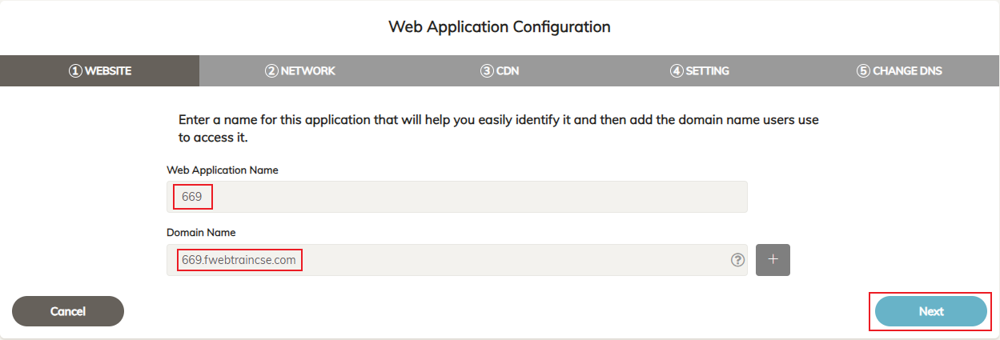
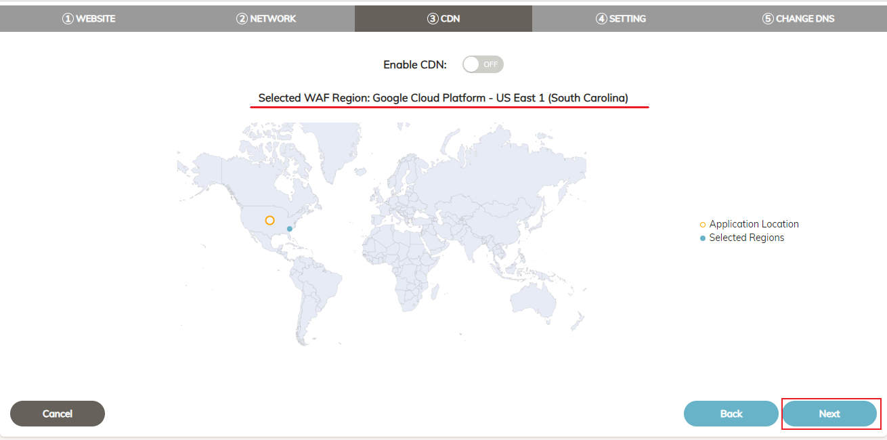
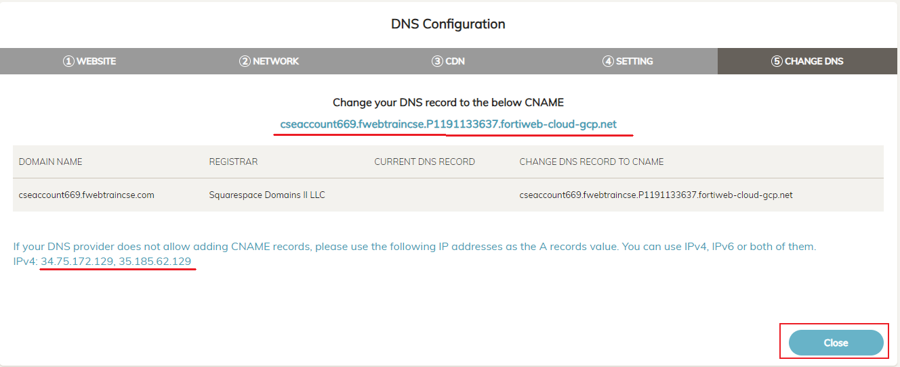

|                            |    |  
|----------------------------| ----
| **Goal**                   | Add Juice Shop Application to FortiWeb Cloud
| **Task**                   | Onboard Application in FortiWeb GUI
| **Verify task completion** | Your Application will show up in the Application list.

Add Application

1. At the top of the screen, clci, on **+ ADD APPLICATION** 

2. For Step 1 "WEBSITE" 

- for **Web Application Name** enter the number of the username found in the email you recieved from **fortinetsecdevops@gmail.com** or at the top right corner of the FortiWeb Cloud Screen.   

{}For example, if the Username is CSEAccount669@fortinetcloud.onmicrosoft.com the number would be 669{}

- For **Domain Name** use number.fwebtraincse.com and then select next

2. For Step 2,

- **unselect "HTTP"** as we want to force users to interact with FortiWeb using only HTTPS.
- For **IP Address or FQDN** enter the JuiceShop Public IP
- For **Port** enter "3000"
- Select HTTP for Server Protocol.  This is Juice Shop and it is NOT secure
- Click on **Test Origin Server**  You should see a green box pop up that says "Test successfully"
- Choose **Next**

3. For Step 3 "CDN" we will not change anything.  You will notice the Selected WAF Region shows the Platform "Google Cloud Platform" and the Region.  

{}FortiWeb Cloud automatically chooses the platform and region based on the IP Address of the application.  There is no user intervention required.{}

- Select **Next**

4. In Step 4 "SETTING" we will **NOT** enable Block Mode

- Select **Save**

5. In Step 5 "CHANGE DNS" We are presented with very important information regarding DNS settings which need to be changed in order to direct traffic to FortiWeb Cloud.  In this lab, we will not be doing this, as sometimes it can take a while for the DNS settings to propagate.  

{} 
Take Note of the IPv4 addresses and CNAME for use in a later step.  **Before you close!**
{}

- Select **Close**

6. You should now see your Application listed in FortiWeb Cloud.  Note that the DNS Status is set to **Update Pending** This is expected and we will ignore it.

{}This is a **Shared Environment** !!!  Please ensure that you are only making changes to **Your Application**.  After Applications are onbaorded into FortiWeb Cloud, Administrators have full RBAC capabilities, but we will not be activating that during this lab.{}