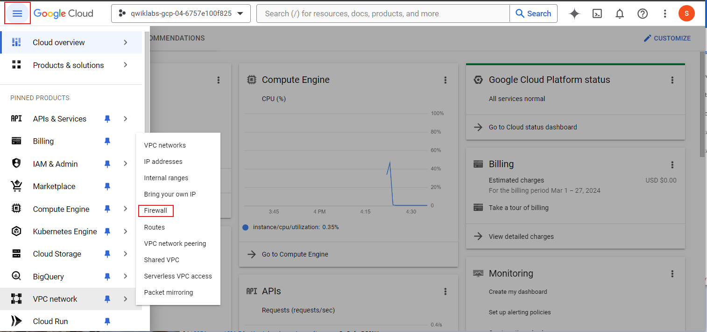
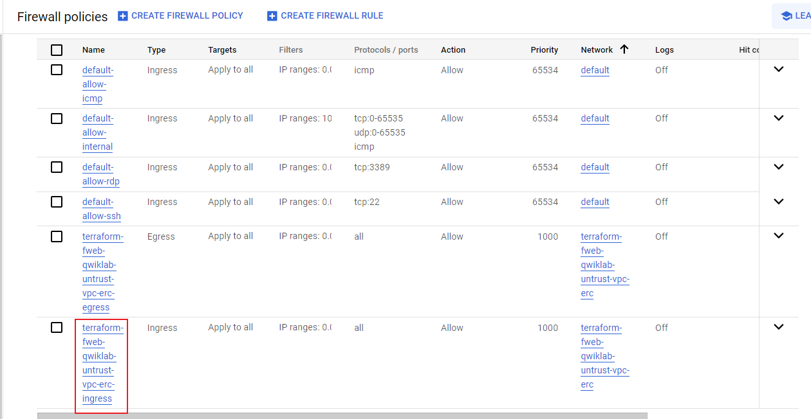
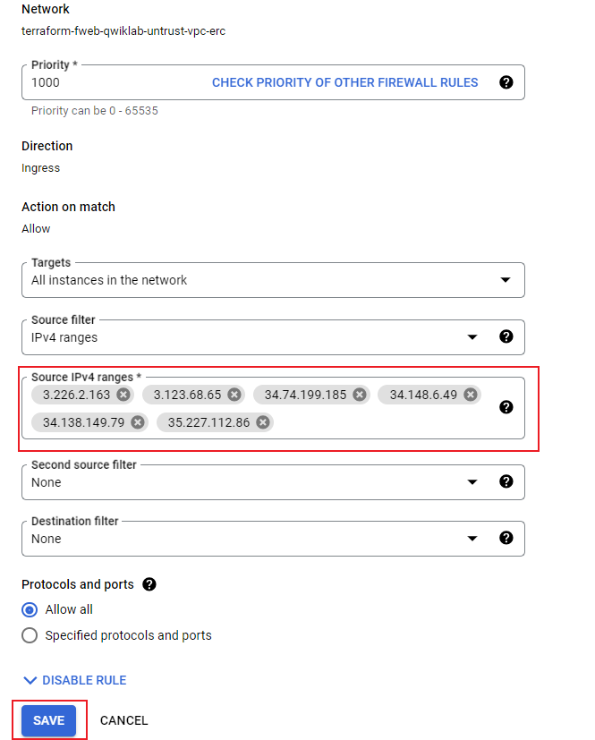

This lab was originally bootstrapped with and ingress firewall rule which allows all ports and protocols from all sources (0.0.0.0/0).  This is not a best practice.  It is recommended, to only allow necessary ports and/or sources.  Now that we have onboarded our application, we want to ensure that the only device that can communicate with our application is FortiWeb Cloud.

{}
For the below steps, ensure that you are in the Protected Project in the GCP Console.  When you log into the console for the first time, you are directed to the Protected Project by default.  This can be changed by clicking on the drop down at the top left of the console screen, between the Google Logo and the Search bar.
{}

Protected Project ID should be visible in the left pane of of the Lab Start Screen.

### Task 1: Modify GCP Network Firewall Rules

1. First, let's grab the IPs which FortiWeb Cloud will use to communicate with your application. From the FortiWeb Cloud Applications page, select **Allow IP List** from the top of the page.  This will open a dialog showing Management and Scrubbing Center Addresses.  Clcik on **Copy to Clipboard**.  Paste these IPs into a text document and then click **Return**

2. In the Google Console, select the "Hamburger" menu at the top left of the screen and navigate to **VPC network > Firewall**

3. Click on the Ingress rule named **terraform-fweb-qwiklab-untrust-vpc-(random)-ingress**

4. Click **EDIT** at the top of the page.

5. Scroll down to **Source IPv4 ranges**.  Delete **0.0.0.0/0** and enter the IP's copied from FortiWeb Cloud in step 1.  Then Click Save

6. To ensure that it worked, use your browser to try and navigate to Juice Shop: http://{{Juice Shop IP}}:3000

You should **NOT** be able to access Juice Shop Directly.