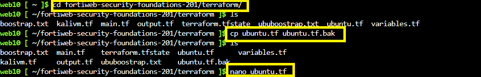
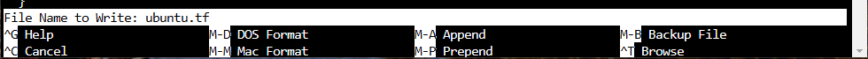
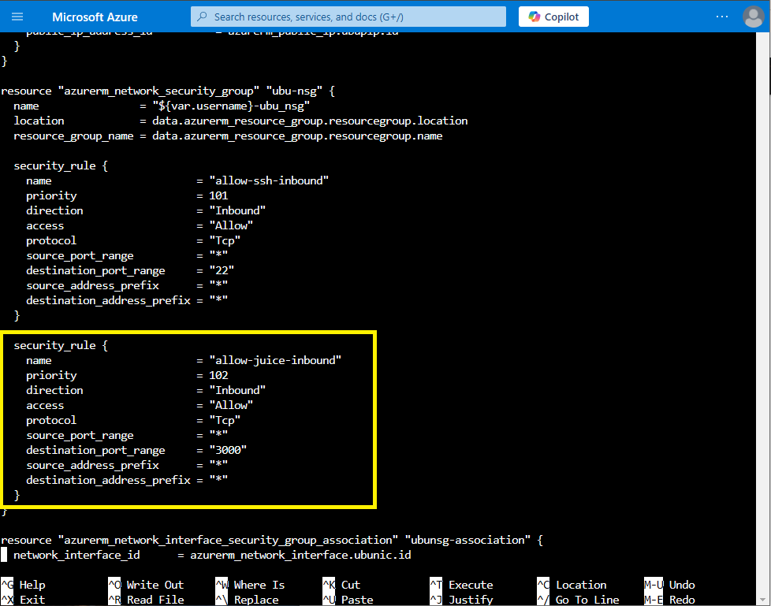
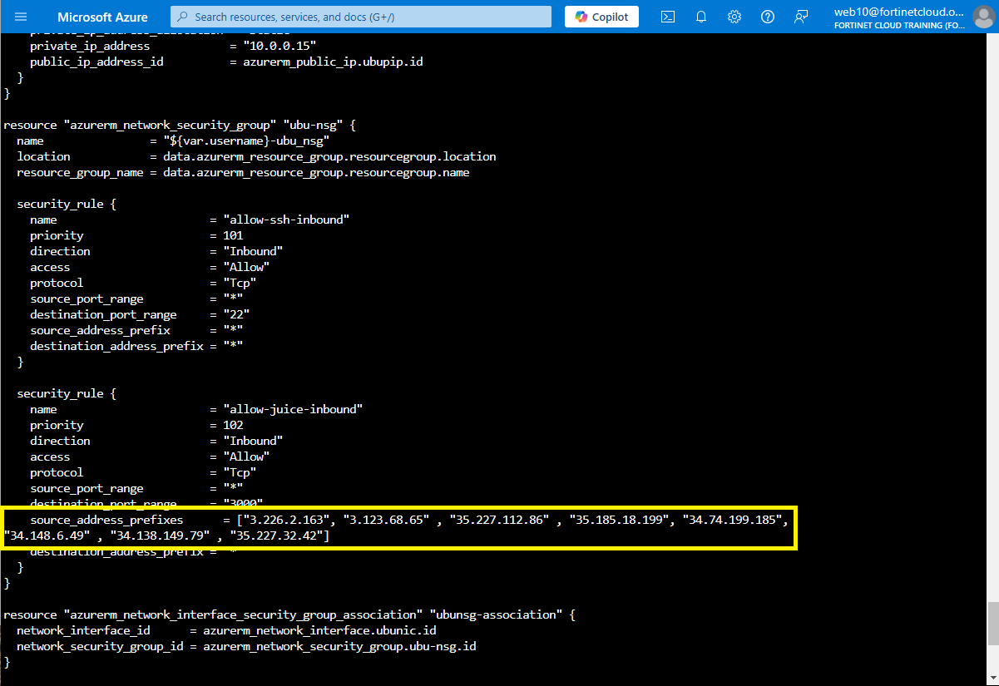
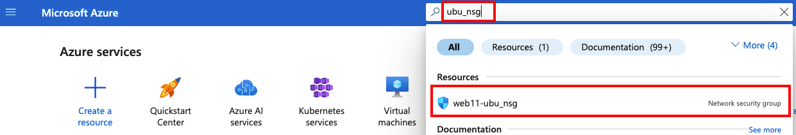
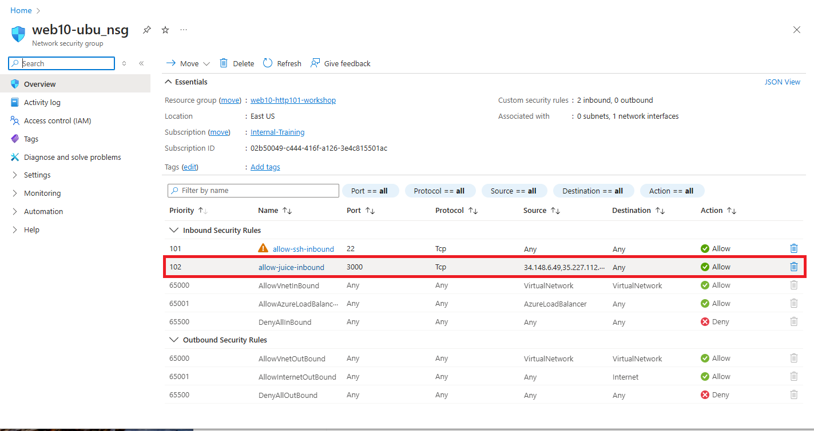

|                            |    |  
|----------------------------| ----
| **Goal**                   | Learn how to lock down Access in Azure
| **Task**                   | Modify  Firwall  in terraform to only allow traffic from FortiWeb Cloud
| **Verify task completion** | You should no longer be able to reach Juice Shop directly from your desktop.

This lab was originally bootstrapped with an ingress firewall rule which allows all ports and protocols from all sources (0.0.0.0/0).  This is not a best practice.  It is recommended, to only allow necessary ports and/or sources.  Now that we have onboarded our application, we want to ensure that the only device that can communicate with our application is FortiWeb Cloud.

**Protected Project ID** should be visible in the **left pane** of of the Lab Start Screen.

### Task 1: Modify GCP Network Firewall Rules

1. First, let's grab the IPs which FortiWeb Cloud will use to communicate with your application. From the FortiWeb Cloud Applications page, select **Allow IP List** from the top of the page.  This will open a dialog showing Management and Scrubbing Center Addresses.  Clcik on **Copy to Clipboard**.  Paste these IPs into a text document and then click **Return**


2. Next, in our Azure cloud shell, we will navigate to our terraform folder by typing ``` cd fortiweb-security-foundations-201/terraform/```

3. First, let's make a copy of our ubuntu.tf file so that we can come back to it later if needed.
    - at the prompt, type ```cp ubuntu.tf ubuntu.tf.bak```

4. Now lets use nano to open and edit our file





In order to Navigate within nano, you can use the **up, down, left and right** arrow keys.  Once you find your text, you can use **backspace** to delete and then just type in the text you want to replace it with.  When you are ready to save type **ctrl+o** You will be asked if you want to write to the current file hit the **enter**key. Then type **ctrl+x** to exit.




5. Navigate down the security rule namded allow-juice-inbound.  Note that currently, we are allowing all source addresses.



6. We are going to delete the source_address_prefix line and replace it with the list of ip's you captured in step one above```source_address_prefixes      = ["first ip" , "next ip" , "next ip"]```.  Save this.  When you are done you can check it by typting ```more ubuntu.tf```



7. Now we will apply these changes by typing ```terraform apply -var="username=$(whoami)" --auto-approve```

8. When this is completed you will see that terraform removed both security rules and added the new ones in their place.

```sh
Terraform will perform the following actions:

  # azurerm_network_security_group.ubu-nsg will be updated in-place
  ~ resource "azurerm_network_security_group" "ubu-nsg" {
        id                  = "/subscriptions/02b50049-c444-416f-a126-3e4c815501ac/resourceGroups/web10-http101-workshop/providers/Microsoft.Network/networkSecurityGroups/web10-ubu_nsg"
        name                = "web10-ubu_nsg"
      ~ security_rule       = [
          - {
              - access                                     = "Allow"
              - destination_address_prefix                 = "*"
              - destination_address_prefixes               = []
              - destination_application_security_group_ids = []
              - destination_port_range                     = "22"
              - destination_port_ranges                    = []
              - direction                                  = "Inbound"
              - name                                       = "allow-ssh-inbound"
              - priority                                   = 101
              - protocol                                   = "Tcp"
              - source_address_prefix                      = "*"
              - source_address_prefixes                    = []
              - source_application_security_group_ids      = []
              - source_port_range                          = "*"
              - source_port_ranges                         = []
                # (1 unchanged attribute hidden)
            },
          - {
              - access                                     = "Allow"
              - destination_address_prefix                 = "*"
              - destination_address_prefixes               = []
              - destination_application_security_group_ids = []
              - destination_port_range                     = "3000"
              - destination_port_ranges                    = []
              - direction                                  = "Inbound"
              - name                                       = "allow-juice-inbound"
              - priority                                   = 102
              - protocol                                   = "Tcp"
              - source_address_prefix                      = "*"
              - source_address_prefixes                    = []
              - source_application_security_group_ids      = []
              - source_port_range                          = "*"
              - source_port_ranges                         = []
                # (1 unchanged attribute hidden)
            },
          + {
              + access                                     = "Allow"
              + destination_address_prefix                 = "*"
              + destination_address_prefixes               = []
              + destination_application_security_group_ids = []
              + destination_port_range                     = "3000"
              + destination_port_ranges                    = []
              + direction                                  = "Inbound"
              + name                                       = "allow-juice-inbound"
              + priority                                   = 102
              + protocol                                   = "Tcp"
              + source_address_prefixes                    = [
                  + "3.123.68.65",
                  + "3.226.2.163",
                  + "34.138.149.79",
                  + "34.148.6.49",
                  + "34.74.199.185",
                  + "35.185.18.199",
                  + "35.227.112.86",
                  + "35.227.32.42",
                ]
              + source_application_security_group_ids      = []
              + source_port_range                          = "*"
              + source_port_ranges                         = []
                # (2 unchanged attributes hidden)
            },
          + {
              + access                                     = "Allow"
              + destination_address_prefix                 = "*"
              + destination_address_prefixes               = []
              + destination_application_security_group_ids = []
              + destination_port_range                     = "22"
              + destination_port_ranges                    = []
              + direction                                  = "Inbound"
              + name                                       = "allow-ssh-inbound"
              + priority                                   = 101
              + protocol                                   = "Tcp"
              + source_address_prefix                      = "*"
              + source_address_prefixes                    = []
              + source_application_security_group_ids      = []
              + source_port_range                          = "*"
              + source_port_ranges                         = []
            },
        ]
        tags                = {}
        # (2 unchanged attributes hidden)
    }

Plan: 0 to add, 1 to change, 0 to destroy.
azurerm_network_security_group.ubu-nsg: Modifying... [id=/subscriptions/02b50049-c444-416f-a126-3e4c815501ac/resourceGroups/web10-http101-workshop/providers/Microsoft.Network/networkSecurityGroups/web10-ubu_nsg]
azurerm_network_security_group.ubu-nsg: Modifications complete after 2s [id=/subscriptions/02b50049-c444-416f-a126-3e4c815501ac/resourceGroups/web10-http101-workshop/providers/Microsoft.Network/networkSecurityGroups/web10-ubu_nsg]

Apply complete! Resources: 0 added, 1 changed, 0 destroyed.
```

9. You can verify this change in the GUI as well.  From the home screen in Azure, find anc click on the resource named **web10-ubu_nsg**



10. You should be able to see the updated security rule.



11. Now try to navigate to the Juice Shop Application from your laptop by typing ```http://<ubuntu ip>:3000``` in your favorite browser.
 - You should **NOT** be able to access Juice Shop Directly.
