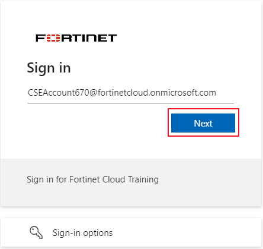
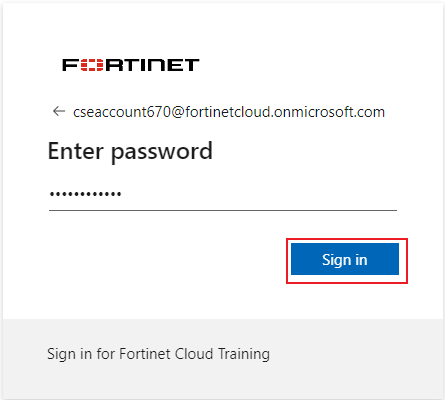
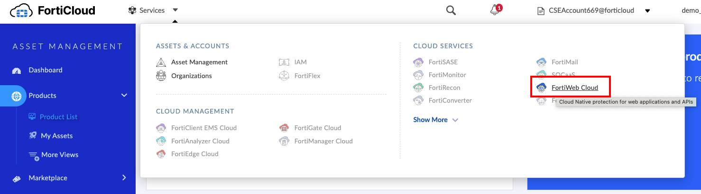
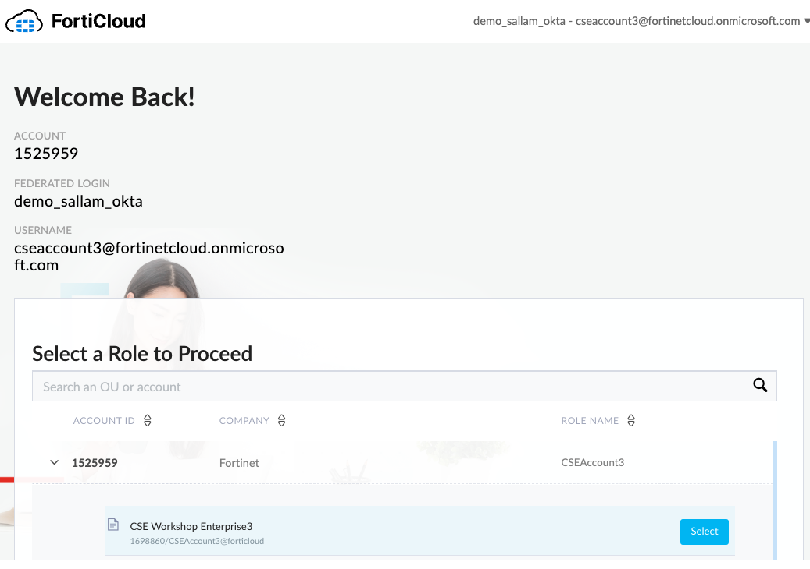

### Log Into FortiWeb Cloud

1.  Using an **Incognito** browser, navigate to the below URL:

```sh

https://customersso1.fortinet.com/saml-idp/proxy/demo_sallam_okta/login 

```

2.  Input the username from the email you received from **fortinetsecdevops@gmail.com** and click **Next**



3.  Input the password from the email you received from **fortinetsecdevops@gmail.com** and click **Sign in**



For the next step, choose **Yes**.  You do want to stay logged in.

{} Sometimes if you wait too long to input your password, you will get SAML login portal error "Error: SAML response with InResponseTo is too late for previous request"  If this happens just click the small blue "Login" link. {}

4. This will take you to the FortiCloud Premium Dashboard. At the top of the screen select **Services** > **FortiWeb Cloud**

{}When you log in, you will see that you are unauthorized to view the FortiCloud Premium Dashboard.  This is expected, as this user has not been given this permission.{}




5. If you have problems, you can always browse to ```https://www.fortiweb-cloud.com```, and click login.  Select your account to proceed to the FortiWeb Cloud console.
