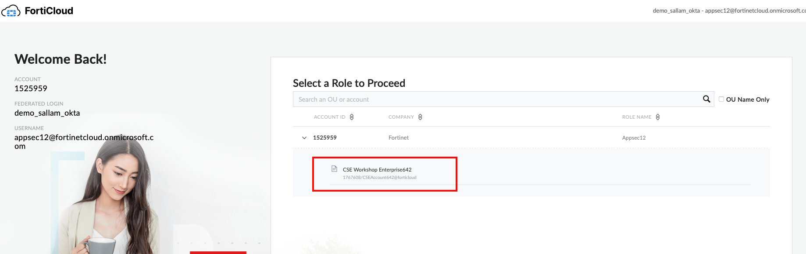
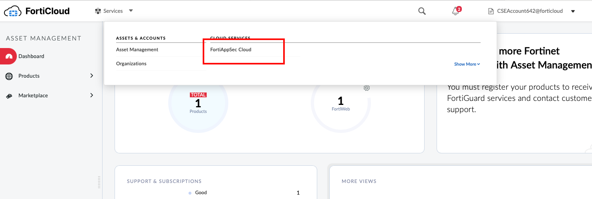
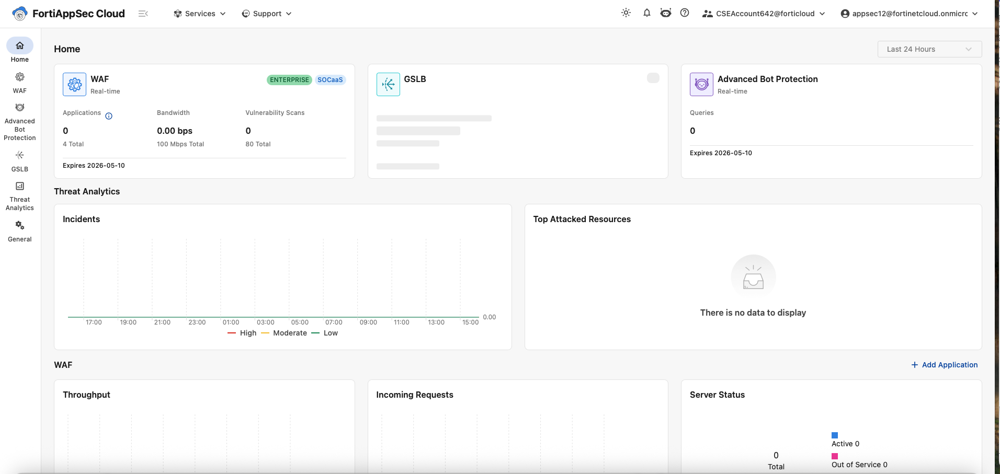

### Log Into FortiAppSec Cloud

1.  Using an **Incognito** browser, navigate to the below URL:

```sh

https://customersso1.fortinet.com/saml-idp/proxy/demo_sallam_okta/login/

```

2.  Input the username from the email you received from **fortinetsecdevops@gmail.com** and click **Next**


3.  Input the password from the email you received from **fortinetsecdevops@gmail.com** and click **Sign in**


For the next step, choose **Yes**.  You do want to stay logged in.

{} Sometimes if you wait too long to input your password, you will get SAML login portal error "Error: SAML response with InResponseTo is too late for previous request"  If this happens just click the small blue "Login" link. {}

4. On the FortiCloud Dashboard, you will be prompted to select a role, select CSE Workshop role as shown below 



5. This will take you to the FortiCloud Premium Dashboard. At the top of the screen select **Services** > **FortiAppsec Cloud**



---



