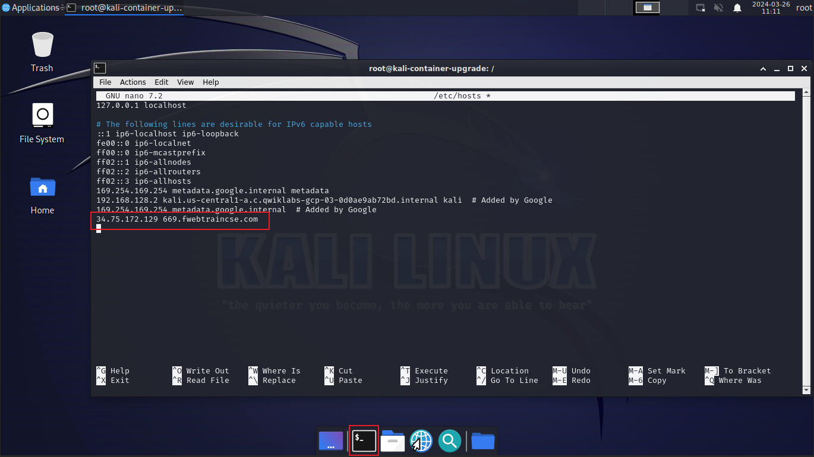

1. Log into Kali linux: https://{{Kali IP}}/vnc.html

2. BSince we did not modify the DNS record we will enter a host entry on Kali.  Open the terminal emulator by clicking on the black box at the bottom of the Kali Hom screen. At the prompt, type:

```sh
bash
sudo nano /etc/hosts
```

3. When the host file opens you will need to add in the host entry in the format "ip address number.fwebtraincse.com" at the bottom of the file.  For this you can enter one or both of the IP Addresses you noted earliear in Chapter 2 Task 1 "Step 5" of the onboarding.   Once this is complete, type **ctrl+o** followed by **enter** and then **ctrl+x**



4. Now let’s Navigate to the browser (located at thebottom of Kali home page) and type the URL. into the navigation bar https://number.fwebtraincse.com.  Accept warnings and proceed to the application

{}If we had modified the DNS record at the begining of this lab, FortiWeb would have pulled a valid SSL certificate from Let's Encrypt.{}


5. Let’s perform a very simple SQLi attack. To perform a SQLi attack append ?name=' OR 'x'='x to your URL.  Be sure that you use **YOUR NUMBER**.  Below is just an example.

```sh

For example: https://669.fwebtraincse.com/?name=' OR 'x'='x

```

{}
The attack will go through and you will see the Juice Shop Home page
{}

