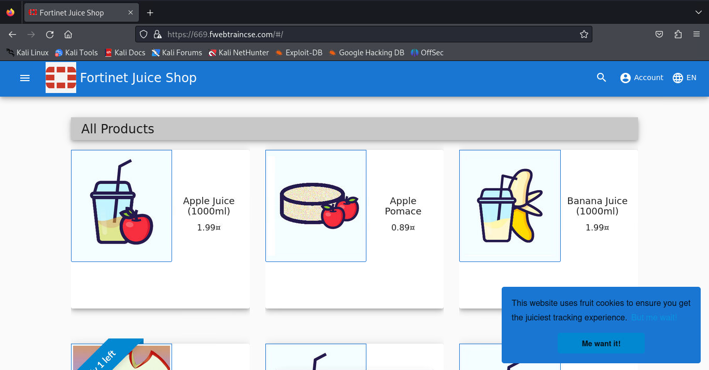

|                            |    |  
|----------------------------| ----
| **Goal**                   | Perform SQL injection attack
| **Task**                   | Perform a simple browser based attack
| **Verify task completion** | You should see that the SQLi attack is accepted by Juice Shop.


1. Navigate to the Firefox browser (located at the top of Kali desktop) and enter our FortiWeb Cloud Protected Juice Shop URL into the navigation bar ```https://number.fwebtraincse.com```.  Accept warnings and proceed to the application



2. Let’s perform a very simple SQLi attack. To perform a SQLi attack append ```?name=' OR 'x'='x``` to your URL.  Be sure that you use **YOUR NUMBER**.

   - For example (be sure to use your studentId)
     - ```https://669.fwebtraincse.com/?name=' OR 'x'='x```


{}
The attack will go through and you will see the Juice Shop Home page
{}

