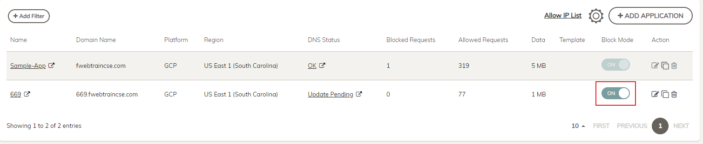

|                            |    |  
|----------------------------| ----
| **Goal**                   | Block SQLi attack
| **Task**                   | Enable block mode in FortiWeb Cloud
| **Verify task completion** | You should see a block page in your browser

1. Enable Block Mode on FortiWeb Cloud

    On the Applications page enable block mode by clicking on the Block Mode button
    
    
    
    {}
    It can take two to three minutes for changes to take effect in FortiWeb Cloud
    {}

2. Repeat the same step to perform SQLi attack in the browser.

   - For example (be sure to use your studentId)
     - ```https://669.fwebtraincse.com/?name=' OR 'x'='x```

    {}
    You will see that FortiWeb now blocks the SQLi attack.
    {}

    


3. Now clicking on the Application Name in FortiWeb Cloud to navigate to our application page.  
    - This should take you to the Application **Dashboard**.  
    - You should see a Threat listed in the **OWASP Top 10 Threats box called A03:2021-Injection**.  Click on it.

    

4. Navigate through some of the tabs.

    

5. On the **Threats** tab, click on the Threat.  
   - In this case **Known Attacks**.  
   - This will take you to a list showing dates when this type of attack was encountered.  
   - If you click on the Arrow next to the date, more information about that incident can be seen.  
   - Spend some time clicking around on the Clickable links in this output.  
     - There is a lot of information available from here, including a link to the OWASP Top 10 site describing this attack as well as HTTP header information and matched patterns.

         
