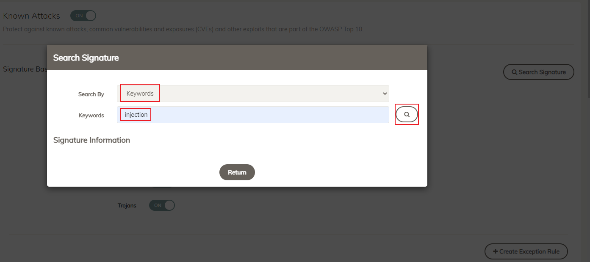

|                            |    |  
|----------------------------| ----
| **Goal**                   | Explore FortiAppSec Cloud Security Features
| **Task**                   | Navigate through the FortiAppSec Cloud GUI menu
| **Verify task completion** | You should have a better idea of what security features are available with FortiAppSec Cloud.

### FortiAppSec Cloud Options


If you lose access to the FortiAppSec Console, open an <strong>Incognito</strong> browser and use the link below to log back in:

<pre><code>https://customersso1.fortinet.com/saml-idp/proxy/demo_sallam_okta/login/</code></pre>


In the previous task, we simply turned on Block Mode in FortiAppSec Cloud.  This enabled the default, minimum security configuration.  Take a moment now to click through some of the menu options on the left to see what Features are enabled by default.  We will also look at how to enable new features.

1. Navigate to **Security Rules** on the left menu and click on **Known Attacks** to see what features are turned on.  The first category is Signature Based Detection.  Click the **Search Signature** button on the right and search for the injection Keyword.  

    

2. On the left menu, click through the available menus for **Access Rules, Bot Mitigation and DDOS Prevention**

3. **Vulnerability Scan** is an add-on paid service that can be added to FortiAppSec Cloud, which will scan your protected Applications for OWASP Top 10 vulnerabilities.

    {}
    More information can be found in the docs at:
    https://docs.fortinet.com/document/fortiweb-cloud/23.3.0/user-guide/898181/vulnerability-scan
    {}

4. Next Click on **+ Add Modules**.  This is where we can activate additional security features.  These features are all covered under the FortiAppSec Advanced license, which is billed based on the number of websites protected and the average Mbps throughput in aggregate for all protected sites.

    {}
    FortiAppSec Cloud Datasheet:
    https://www.fortinet.com/content/dam/fortinet/assets/data-sheets/pdf/fortiappsec-cloud.pdf
    {}
