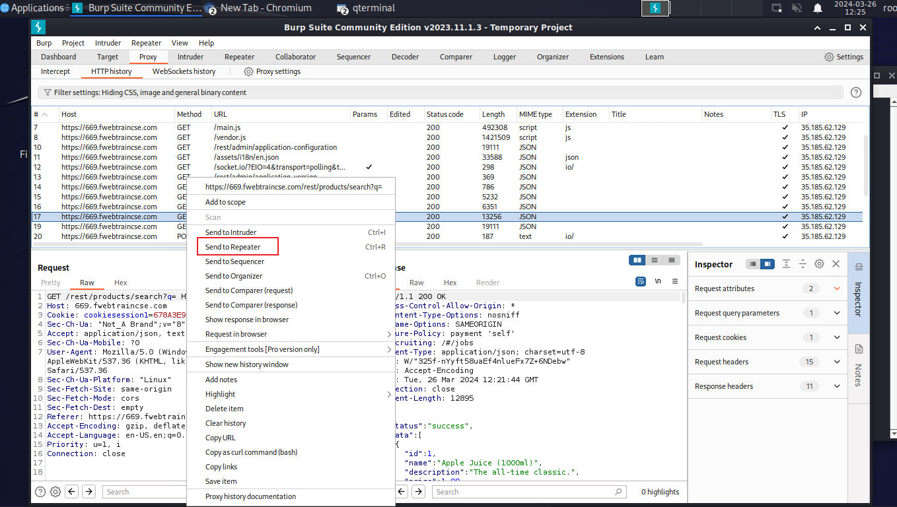
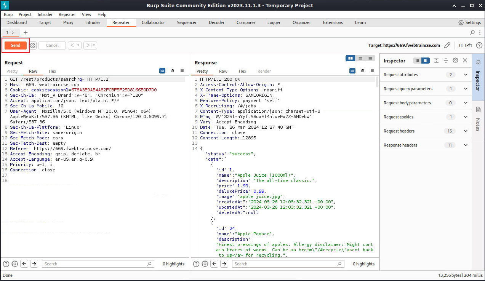

Burp Suite gives us a quick and easy way to query targeted sites.

1. At the bottom of the Kali home page, click on the terminal icon (black box).  Once open, input:

```sh

burpsuite

```

2. Burp Suite will pop up. Accept all of the warnings and EULAs.  Leave Temporary Project selected and click **Next**


3. Leave "Use Burp defaults" selected and click **Start Burp**.


4. Accept the warning that Burp Suite is out of date and then select settings at the top right of the screen.


5. In the settings menu, select **Burp's browser**.  Under **Browser running** check the box for "Allow Burp's browser without a sandbox"


>*Note: once the button is clicked, just close the settings menu.  There is no need to save.*

6. Click on the **Proxy** tab at the top of the Burp Suite screen.  This will bring you to the Intercept screen.  Click on **Open Browser**.  Ignore Error and proceed to next step.


7. In the browser URL bar, input https://number.fwebtraincse.com and hit enter.  This will bring you to the juice shop home page.

8. Minimize the browser and click on the **HTTP History** tab under Proxy.  Scroll down the list until you find a URL labeled **"/rest/products/search?q=**.  Select this line and right click.  Then click on **Send to Repeater**.  This will allow us to manipulate the requests in order to do a little nefarious recon.



9. At the top of Burp Suite, Click on the **Repeater** Tab.  You will see the request we just sent.  Now click on the **Send** Button.  This will populate the Response area.



10. Now we are going to modify our query a bit.  Click on the First line in the Raw request and add **'--** to our get request after.  The GET should now look like **/rest/products/search?q='--**.  Click **Send**.  We will now see an error in the Response section.  This error tells us that the database is SQLITE and uncovers a vulnerability.


{}It's worth mentioning that the standard signature based Web Protection Profile did not catch this attempt. If Machine Learning were enabled, this would not have gone through.  Instead it would have been identfied as an anomaly and then passed to the threat engine where it would have been identified as an SQL Injection attempt.  We are not using ML in this lab, as the number of samples required to train the Model would be time prohibitive{}
