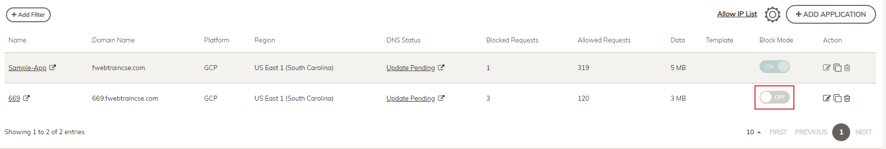

|                            |    |  
|----------------------------| ----
| **Goal**                   | Use SQLMAP to find Vulnerability
| **Task**                   | Activate SQLMAP and scan Juice Shop
| **Verify task completion** | After FortiWeb block mode is disabled, SQLMAP should identify that get parameter 'q' is vulnerable

Now that we know what the Database type is, we can use sqlmap to see if we can get some "Juicy" information (pun intended).  You could just run SQLMAP initially to find the vulnerability, but It would take much longer without an idea of what you were looking for.

1. Open a new terminal on Kali, and take a look at the SQLmap help page.  I also think it's helpful to use bash shell here, as we will want to be able to use the up arrow in order to scroll though old commands

```sh

bash
sqlmap -h

```

2. Now we will attempt to discover what typ SQL injection vulnerabilities exist.  Since we know that the database runs on **sqlite** we can shorten the scan time by giving sqlmap that information.  Input the first line below at the terminal, substituting your URL. **Make sure to change "number" in the URL below to your student number**

```sh

sqlmap -u "https://number.fwebtraincse.com/rest/products/search?q=" --dbms=SQLite --technique=B --level 3 --batch

```

{}This attempt will fail, due to the default protections offered by FortiWeb.  It is still recommended to use ML in production in order to prevent reconnasiance from previous step{}


3. Disable Block Mode on your application in FortiWeb Cloud



4. Re-run the sqlmap attempt.  You will see that some vulnerabilities were found.


{}
Please re-enable block mode for your application before moving forward.
{}