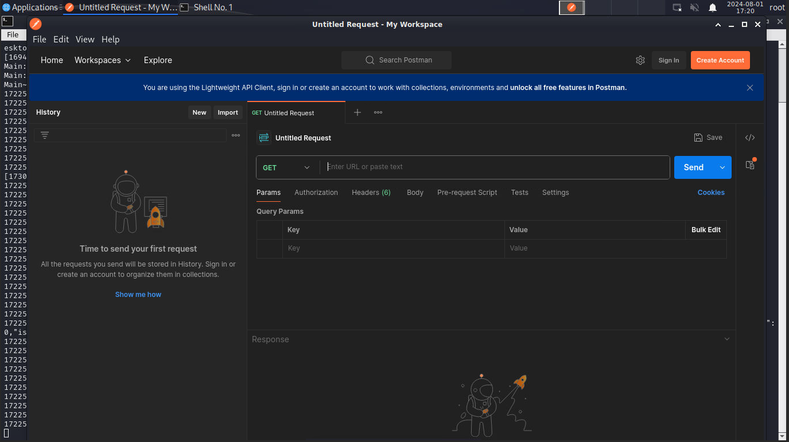

1.  Open postman by opening a new terminal (not bash) and type ```Postman``` at the prompt.  This should start the postman application.



- When postman comes up, select "Or continue with lightweight API client


2.  Now, let's make an api call to search for Apple Juice.  Use the below url, but replace the url with your student url.

```sh
https://<number.fwebtraincse.com>/rest/products/search?q=Apple
```

3.  This first call will fail, due to a certificate error.  In the response section, you will need to scroll down and select "Disable SSL Verification".


4. Now the Call should go through an you should see a status 200 and returned data.


