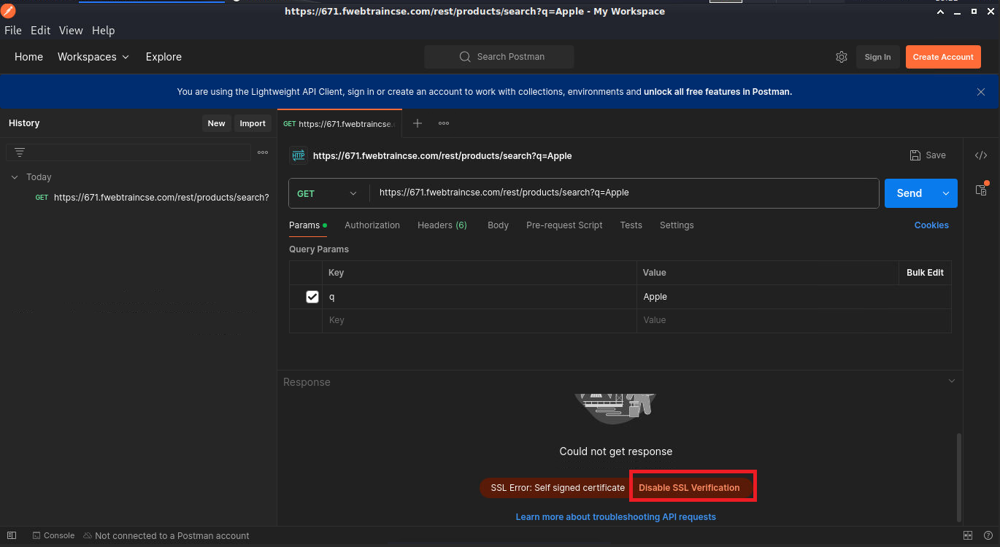

|                            |    |  
|----------------------------| ----
| **Goal**                   | Call Juice Shop API with Postman
| **Task**                   | Configure Postman and GET information about Apple Juice from the product page
| **Verify task completion** | The Postman Request should successfully return data for the Apple Juice product

1.  Open postman by opening a new terminal (not bash) and type ```Postman``` at the prompt.  This should start the postman application.
{}

If Postman doesn't open, it's likely due to the terminal still using Bash.  To exit bash, simply type ```sh```

{}

   - When postman opens, select **Continue without an account**
    
   - Now select **Open Lightweight API Client**
    

2.  Now, let's make an HTTP GET API call to search for Apple Juice.  Use the following URL, ensuring you replace your studentID.

    ```sh
    https://<studentID>.fwebtraincse.com/rest/products/search?q=Apple
    ```

{}
If the first call fails, due to a certificate error.  In the response section, you will need to scroll down and select "Disable SSL Verification".

{}

3. Now the Call should go through an you should see a status 200 and returned data.


    
