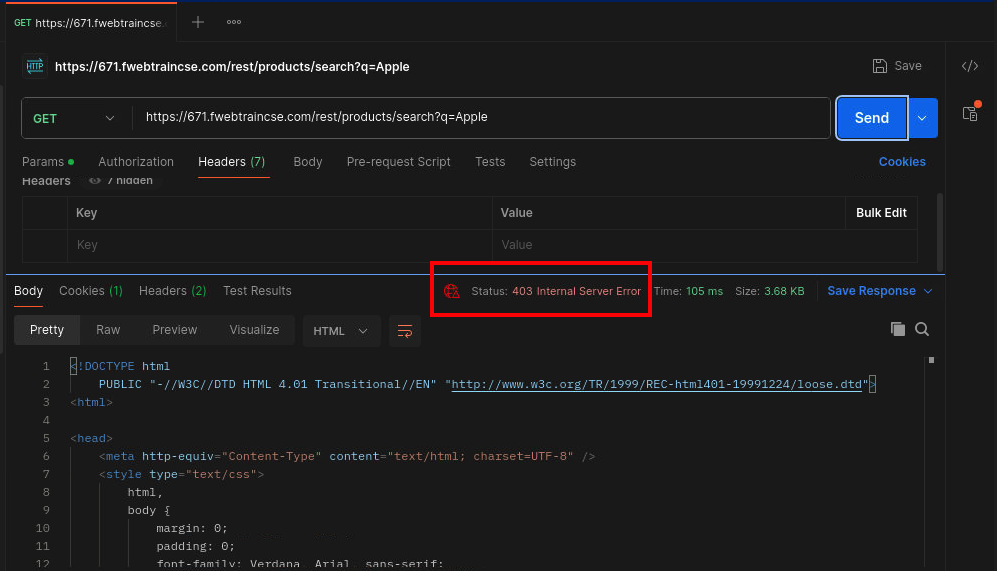
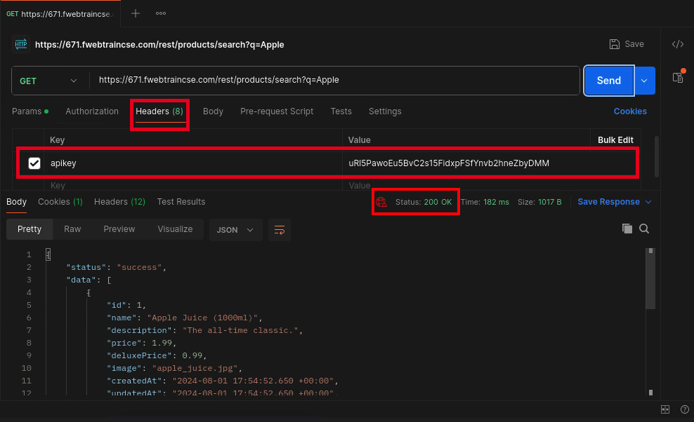

|                            |    |  
|----------------------------| ----
| **Goal**                   | Setup API Gateway on FortiAppSec Cloud
| **Task**                   | Enable and Configure API Gateway and then test function using Postman
| **Verify task completion** | If successful, API requests will require submission of an API Key in order to access data

### Setup API Gateway

If you lose access to the FortiAppSec Console, open an <strong>Incognito</strong> browser and use the link below to log back in:

<pre><code>https://customersso1.fortinet.com/saml-idp/proxy/demo_sallam_okta/login/</code></pre>


1.  From the FortiAppSec Cloud Console select your application and in the left pane, select **Waf >** **ADD MODULES**.  Scroll down and turn on **API Gateway** under API Protection.

    

2.  Now API PROTECTION should show up on the left side of the screen. Under API PROTECTION, select **API Gateway**

3. Click to **Create an API User**. Add a **Name** and **Email address** Then Click **OK**

    

4.  Next click **Create API Gateway Rule**.  

    - Name: choose a name such as ```rest```
    - For both "Frontend" and "Backend", enter ```/rest/``` then click **Add URL Prefix**
    - turn on API Key Verification
    - choose **HTTP Header** for API Key In
    - for Header Field Name enter ```apikey```
    - for Allow Users, select the user you created in step 3
    - leave the Rate limits at default
    - select **OK**
    

5. You will need to click **Save** at the bottom right.  Now you should have an API key. Click on the eye icon to display the key.  Copy it and put it into a note pad.

    

6. Ensure that the action is set to **Alert & Deny** and then click **Save**

    
    


### Test API gateway

1.  Back on Kali Desktop, In Postman, click **Send** again to re-test your api call.  It should return status 403 and return a long error page ending with "Please contact the administrator..."

    

2. Now, let's add a key

   - select **Headers** under the URL bar.
   - enter ```apikey``` for Key
   - enter the previously copied key for Value
   - click the empty box next to apikey to send this header
   - click **Send**

    You should see code 200 and returned data.

    