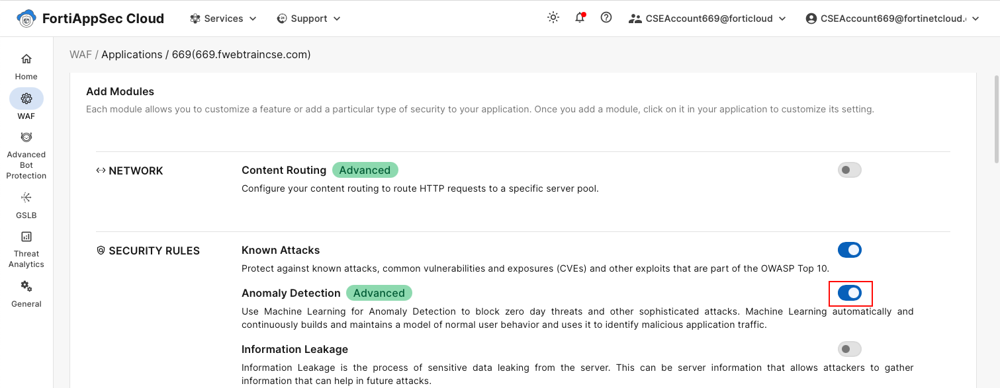
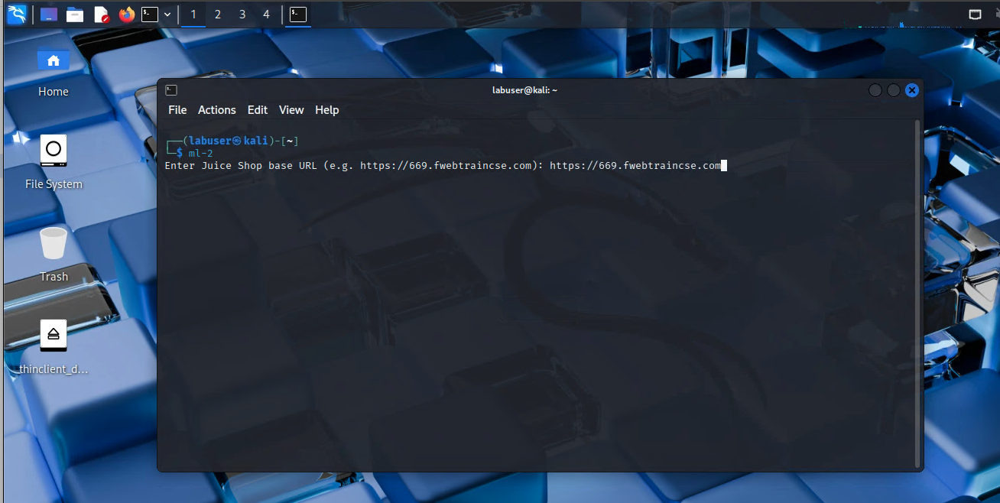
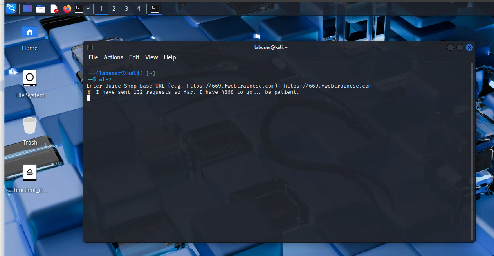
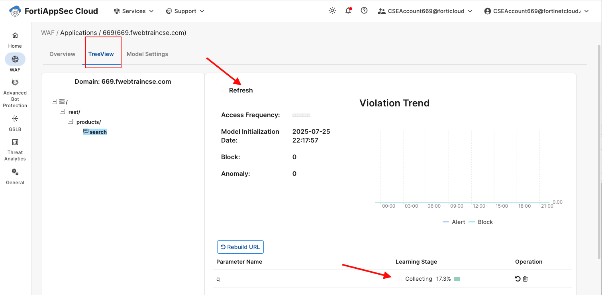
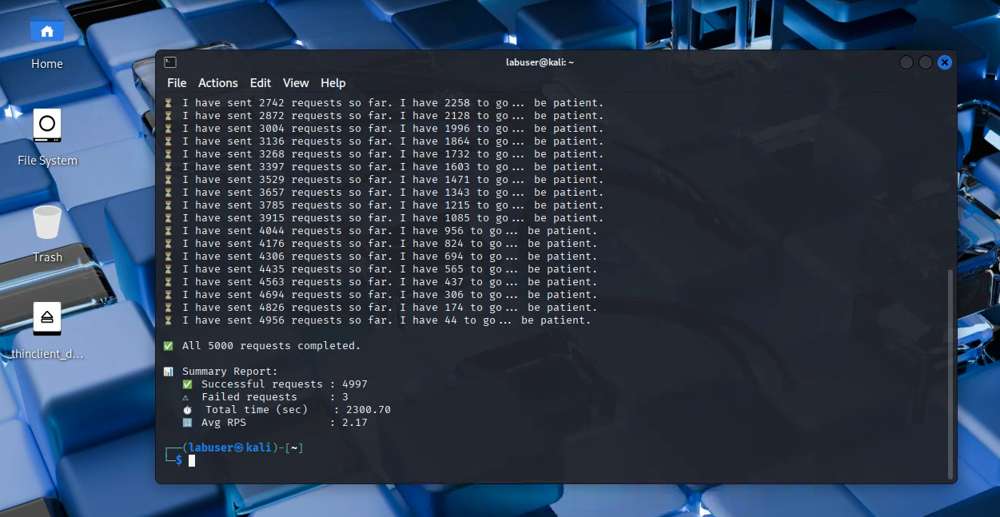

## Enabling Anomaly Detection in FortiAppSec

In this section, we will enable the **Anomaly Detection** module, which uses machine learning to block zero-day threats and other sophisticated attacks. This module builds a behavioral model by analyzing legitimate traffic patterns, allowing it to detect anomalies and unknown attack types.

To train the model, we will use a tool that generates a sufficient number of legitimate requests. Please note that the tool may take approximately **30 minutes** to complete its run.

### Step 1: Enable the Anomaly Detection Module

1. From the **FortiAppSec Cloud Console**, select your application.
2. In the left navigation pane, go to **WAF > ADD MODULES**.
3. Scroll down to the **Security Rules** section.
4. Toggle **Anomaly Detection** to **On**.




### Step 2: Run the Tool to Generate Legitimate Traffic

To build the anomaly detection model, you need to generate a sufficient number of legitimate requests. Follow these steps:

1. Open a terminal window from your Kali desktop.

   Run the following command:

   ```./ml-2`` 

2. When prompted, enter the URL you are targeting in the following format:


   ```https://<FortiWebStudentID>.fwebtraincse.com```

   

  The tool will begin sending requests to simulate legitimate user traffic. You will see progress messages in your terminal window indicating how many requests have been sent and how much time remains. Progress report takes about 90 seconds to show up so please be patient and avoid starting the tool multiple times. 



⚠️ Note: The process may take up to 30 minutes to complete. Please keep the terminal open during this time.

3. While the tool is running, you can proceed to the next step by logging into the FortiAppSec Cloud Console and observing the model-building progress 


### Step 3: Review the Anomaly detection module on FortiAppSec Cloud


If you lose access to the FortiAppSec Console, open an <strong>Incognito</strong> browser and use the link below to log back in:

<pre><code>https://customersso1.fortinet.com/saml-idp/proxy/demo_sallam_okta/login/</code></pre>



1. From the **FortiAppSec Cloud Console**, select your application.
2. In the left navigation pane, select **Waf > Security Rules > Anomaly Detection** 
   click on the **TreeView** TAB and drill down to the search parameter field and notice how it is going through the diffrent stages: 
   **Collecting, Building and Running**

   

   

Building the model can take up to 30 minutes. Please do not delete once it is built. we will need it for the next exercise 



once the tool finishes running you will see a message like the one shown below 


3. When the model gets to the running Stage we will be ready to proceed to launching some attacks.




### Step 4: Launch Attacks 
To test the model that was built above, we will run another tool that will launch various **SQL injection**, **command injection**, and **XSS attacks**, along with legitimate requests.

1. Open a terminal window from your Kali desktop.

   Run the following command:

   ```./ml-mix``` 

2. When prompted, enter the URL you are targeting in the following format:


   ```https://<FortiWebStudentID>.fwebtraincse.com```

The tool will begin sending requests to simulate a mix of attack and legitimate user traffic