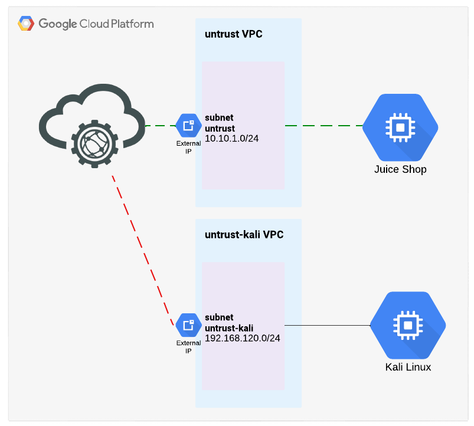

### Welcome!

In this lab, you will have an opportunity to configure FortiWeb Cloud to protect a Juice Shop server, emulating a very vulnerable e-commerce website.  Students will onboard their application and then run a few simple attacks, as well as turn on several security features, in order to learn more about FortiWeb Cloud's capabilities.

### FortiWeb
FortiWeb is Fortinet's Web Application and API security platform, enabling enterprise customers to protect web applications no matter where they are deployed.  FortiWeb defends web applications and APIs against OWASP Top-10 threats, DDOS attacks, and malicious bot attacks. Advanced ML-powered features improve security and reduce administrative overhead. Capabilities include anomaly detection, API discovery/protection, bot mitigation and advanced threat analytics to identify the most critical threats across all protected applications.

FortiWeb Cloud WAF as a Service (WAFaaS) reduces administrative overhead by offering the full suite of FortiWeb security features without the need to manage VMs and networking.  Customers simply change their DNS records so that all appication traffic is proxied through FortiWeb Cloud.

### Learning Objectives
- Learn to Onboard Web Applications 
- more stuff
- other stuff

## Lab Environment

Below is a diagram of the Lab environment.

